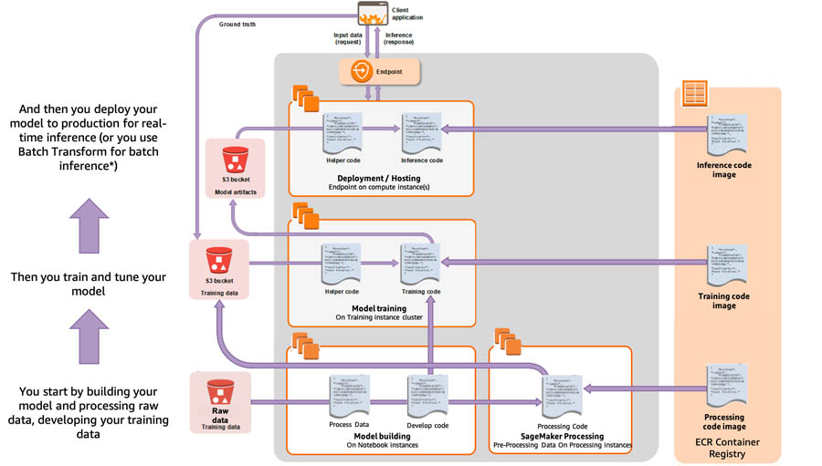

# SageMaker Cost Optimization 

**마지막 업데이트: 2022.09.30**

---
SageMaker 의 비용 최적화를 위해서 주요한 모범 사례의 요약을 기술 합니다. 자세한 사항은 참조의 블로그 및 기타 링크를 확인 부탁 합니다.

---

## 0. SageMaker ML Lifecycle 단계

## 1. Right-Sizing 컴퓨팅 인스턴스를 사용
- 배경 및 목적
    - ML Workflow의 모델 개발 (Build), 모델 훈련 및 튜닝 (Training and Tuning), 그리고 서빙 (Deployment and Serving) 에 사용되는 컴퓨팅 인스턴스를 잘 결정해야 함.
- 인스턴스 타입
    - T, M: 일반적 목적의 인스턴스
    - C: Computing-optimized 인스턴스
    - R: Memory-optimized 인스턴스
    - P, G and Inf: GPU-optimzied 인스턴스

## 2. 개발 환경 (Build Environment)
- 배경 및 목적
    - 노트북 인스턴스 및 스튜디오 노트북은 데이터 탐색, 스크립트 코드 작성, 피쳐 엔지니어링 및 모델링의 프로토타이핑에 사용
- 모범 사례
    - 작은 인스턴스 사용을 권장하고, 무겁고 대용량의 전처리, 모델 훈련 및 튜닝은 `일시적인 전처리, 훈련, 튜닝 Job` 을 생성하여 사용.

## 3. 전처리 환경 (Processing Environment)
- 배경 및 목적
    - 개발 환경에서 데이타 탐색 및 프로토타이핑이 완료 된 후에 데이터 전처리를 위해서 SageMaker Processing 등을 사용.
- 모범 사례    
    - Processing Job 을 실행하여 사용한 시간 만큼만 지불
    - Processing Job 을 비동기적으로 실행 `.fit(wait=False)` 를 통해서 실행하고 사용하고 있는 노트북은 셧다운 하는 방법도 가능. (아래 모델 훈련도 동일)
    - 많은 양의 데이터는 여러 작은 인스턴스 사용을 통한 분산 전처리를 이용하여 비용 줄임 (분산 처리시 데이터 샤딩 적용)

## 4. 모델 훈련 및 튜닝 (Training and Tuning Environment)
- 배경 및 목적
    - 무거운 훈련 작업은 개발 환경에서 실행하지 않고 "훈련 및 튜닝 Job" 을 생성하여 사용한 시간 만큼만 금액 지뷸
- 모범 사례    
    - Instance family (e.g. C, P, G type) 
        - 알고리즘에 따른 고려 및 분산 훈련으로 빠르게 완료 하여 비용 절감 고려
    - Instance Size 
        - 예: 분산 훈련 없이 ml.p3.2xlarge (Nvidia V100 GPU 1장), 분산 훈련시 ml.p3.8xlarge (Nvidia V100 GPU 4장)
    - Insance Count 
        - 분산 훈련 여부에 따라 1개 혹은 그 이상을 사용.
    - Spot 인스턴스 모델 훈련 고려 (최대 90% 비용 감소)     

## 5. 모델 서빙 (Deployment / Hosting Environment)
- 배경 및 목적
    - 일반적으로 전체 ML 비용의 약 90% 가 소요 됨. 전체 비용 감소를 위해서 가장 집중해야할 영역 임.
- 모범 사례    
    - 호스팅 옵션 고려
        - Real Time Endpoint (항상 서빙 엔드포인트가 실행 됨)
        - Batch transform (배치로 한번 추론하는 비용만 지불)
        - Serverless Inference (사용이 없으면 엔드포인트 내력가서 비용 발생 안함.)
        - Asyncronous Inference (단발성의 큰 추론 데이터 사이즈에 적합)
    - Load Testing 을 통한 적당한 인스턴스 타입 선택
    - Multi-Model Endpoint 고려 
        - 한개의 Container 혹은 여러 Container 에 여러 비슷한 유형의 모델들을 호스팅
    - 오토 스케일링을 통한 인스턴스 Scale-In 및 Scale-Out
    - 대용량 추론에 적합한 Triton Serving 고려
    - 추론에 최적화된 Inferentia 인스턴스 고려

## 6. 불필요한 비용 제거 추천
- 개발환경의 사용하지 않은 노트북 인스턴스의 제거
    - Lifecycle configuration (세이지 메이커 노트북 인스턴스) 및 JupyerLab extenstion (Studio Notebook) 사용
- 스케줄러를 사용한 노트북 인스턴스의 자동 시작 및 정지
    - 예를 들어서 주중 9:00 시작 및 6:00 정지로 스케줄하여 사용 함.
- 호스팅 환경의 사용하지 않은 엔드포인트 제거
    - 최신 과거 (예: 과거 48시간) 동안 # of invocations 가 0 이면 엔드포인트 삭제
    
## A. 참조:
- 블로그 (Sep 2020 발행) : 
    - [Ensure efficient compute resources on Amazon SageMaker](https://aws.amazon.com/blogs/machine-learning/ensure-efficient-compute-resources-on-amazon-sagemaker/)

