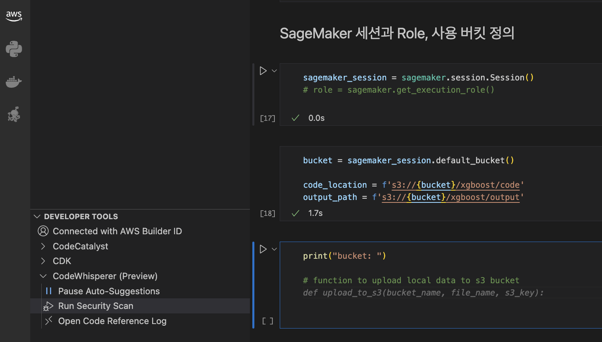

# 로컬 머신에서 Visual Studio Code 를 사용하여 SageMaker 훈련 코드 작성 하기  

**마지막 업데이트: 2023.04.09**

관련 링크는 업데이트 시점의 유효한 링크 입니다. 이후 변경이 될 수 있습니다.

---

SageMaker 가 제공하는 SageMaker Studio, Notebook 을 통하여 모델 훈련 코드를 작성할 수 있습니다. 또한 데이터 과학자 분들은 본인의 개발 환경 및 로컬 머신(예: 개인 노트북) 에서 SageMaker 훈련 코드를 작성하고, 로컬에서 모델 훈련을 해보고, 또한 SageMaker 클라우드에서 모델 훈련을 하고 싶어 합니다. PyCharm 에서 실제 이런 작업을 소개하고 있는 블로그 인 [Run your TensorFlow job on Amazon SageMaker with a PyCharm IDE](https://aws.amazon.com/blogs/machine-learning/run-your-tensorflow-job-on-amazon-sagemaker-with-a-pycharm-ide/) 를 참조 하시면 됩니다. 여기서는 Visual Studio Code 에서 설치 및 실제 로컬 모드 및 클라우드 모드를 통해 훈련하는 것을 보여 드리겠습니다.

저는 아래와 같은 저의 노트북을 사용하였습니다.

# 0. 테스트 머신
- MacBook Pro
    - Chip: Apple M1 Pro 
    - macOS: Ventura 13.3
 
이제 저의 테스트 머신에는 아래의 필요한 것을 설치 합니다.


# 1. 로컬 환경 구성

- VS Code 설치
    - [Code editing.Redefined](https://code.visualstudio.com/)
- VS Code Extension 설치 (아래 링크 참조 하세요)
    - Install Python extension and Jupyter
        - [Data Science in VS Code tutorial](https://code.visualstudio.com/docs/datascience/data-science-tutorial)
- Anaconda 설치
    - 아래는 Anaconda 의 최소 버전 (Conda, Python 만 포함) 설치
    - [Miniconda](https://docs.conda.io/en/latest/miniconda.html)
- Git 설치
    - [Download for macOS](https://git-scm.com/download/mac)
- Docker-compose 설치
    - "Docker Desktop for Mac with Apple sillicon" 을 다운로드 해서 설치 합니다. 이를 설치하면 Docker-compose 도 같이 설치 됨.
    - [Install Docker Desktop on Mac](https://docs.docker.com/desktop/install/mac-install/)
        
그리고 옵션으로서 AWS Toolkit 설치를 합니다. 이 링크를 보시면 쉽게 설치할 수 있습니다. 
- [Install AWS Toolkit](https://www.youtube.com/watch?v=hYtYaFVWcCU)

아래는 실제 Visual Code 의 왼쪽 Extensions 를 클릭하고, 서치 박스에 aws 를 입력하면 AWS Toolkit 이 나옵니다. 클릭하여 설치 하시면 됩니다. 이후에 [Setting up CodeWhisperer for individual developers](https://docs.aws.amazon.com/codewhisperer/latest/userguide/whisper-setup-indv-devs.html) 를 따라서 Builder ID 를 생성하여 연결하시면 됩니다.
- 
    
    
# 2. AWS & SageMaker 연결 설정

연결 설정은 블로그: [Run your TensorFlow job on Amazon SageMaker with a PyCharm IDE](https://aws.amazon.com/blogs/machine-learning/run-your-tensorflow-job-on-amazon-sagemaker-with-a-pycharm-ide/) 를 참조 하시면 됩니다. 여기서는 제가 수행한 과정을 보여 드리겠습니다.

## AWS access key  and secret access key 생성 

AWS Account 를 생성하고, user 를 생성시에 access key ID and secret access key 생성. 이렇게 생성된 access key ID 및 secret access key 는 다른 곳에 저장 해두세요. 이후 설정시에 사용 합니다.
아래는 key 생성 화면을 보여 주고 있습니다.


아래는 user 생성을 한 후에, access key 를 보여 주고 있습니다.


이후 생성한 유저에 아래 두개의 전책 AmazonSageMakerFullAccess and AmazonS3FullAccess 추가 해주세요


## IAM role 생성

SageMaker AmazonSageMakerFullAccess 및 AmazonS3FullAccess 권한에 대한 실행 역할도 필요합니다. SageMaker는 이 역할을 사용하여 SageMaker가 관리하는 AWS 하드웨어에서 사용자 대신 작업을 수행합니다.


## 로컬 컴퓨터에 Access Key 및 Security Key 세팅    

로컬 컴퓨터에 AWS CLI를 설치하고 aws configure를 사용하여 빠르게 구성합니다.

```
    d074660793 ~ % aws configure
AWS Access Key ID [****************BIGP]: 
AWS Secret Access Key [****************/5l8]: 
Default region name [us-east-1]: 
Default output format [json]: 
```
    

# 3. 로컬 모드 및 Cloud 모드 실행 예시 - XGboost

## Git 로컬에 다운로드
아래와 같이 로컬 머신에 깃 리포를 다운로드 합니다. 

`git clone https://github.com/aws-samples/aws-ai-ml-workshop-kr`


## 버츄얼 환경 설치
아래 명령어로 실행하여 가상 환경을 생성 합니다. 여기서는 Tensorflow, keras 등을 사용하기에 같이 설치 합니다.

```conda create -n myenv python=3.10 pandas jupyter seaborn scikit-learn keras tensorflow```
    
## SageMaker Python SDK 설치

아래와 같이 위에서 생성한 가상 환경을 활성화 하고, 이후에 sagemaker python sdk 를 설치 합니다.


## IAM Role 변수 저장
위에서 생성한 IAM Role 을 사용하기 위하여, IAM Role 의 ARN 을 변수에 저장하고, 이후에 노트북에서 로딩하여 사용 합니다. 이렇게 사용을 해도 되지만, role 변수에 실제 ARN 값을 하드코딩하여 테스트를 할 수 도 있습니다.


## 로컬 모드로 1.1.SageMaker-Training.ipynb 노트북 실행 후 화면    

아래는 `instance_type = "local"` 및 session 을 로컬 세션으로 설정한 후에 로컬 모드를 실행한 화면 입니다. SageMaker의 XGBoost 도커 이미지가 로컬에 다운로드 되고, docker-compose 를 통하여 도커 컨테이너가 생성이 되고, 노트북 CPU 를 이용하여 로컬에서 XGBoost 도커 컨테이너가 실행이 됩니다.


## 클라우드(호스트) 모드로 1.1.SageMaker-Training.ipynb 노트북 실행 후 화면    

이제 로컬 모드로 테스트가 완료되었으면, 클라우드 모드로 실행을 합니다. 다른 변화는 없고 `instance_type = "ml.m5.large"` 및 session 을 SageMaker session 으로 설정 후에 실행 합니다.


아래와 같이 SageMaker Console 로 이동해서 보면 아래와 같이 훈련 잡이 생성 되고, 실행이 되는 것이 보입니다.


## 옵션: AWS CodeWhisper 동작 확면

아래는 AWS CodeWhisper 가 설치 되었기에, 주석을 입력하면 함수를 생성해주는 예시 입니다. 이렇게 추천이 되면 "Tab" 키를 클릭하면, 이 내용을 사용할 수 있습니다. "Function to uplaod ..." 이렇게 주석을 기술하면 아래 코드 추천이 됩니다.

    
    
# 4. 로컬 모드 및 Cloud 모드 실행 예시 - Tensorflow

## Git 로컬에 다운로드
위의 XGBoost 의 예시처럼 아래의 깃 리포틀 로컬에 다운로드 합니다.
`git clone https://github.com/cuiIRISA/tensorflow-sagemaker-on-pycharm`

## sm_train.py 실행 (가상 환경이 myenv 상태에서 실행 됨)

다운로드 한 폴더를 오픈 한 후에 sm_train.py 를 실행 합니다. 이 파일의 실행 전에 tf_code/tf_script.py 를 먼저 실행 해주세요. 이 스크립트는 로컬에서 실행이 되고, 훈련 데이터를 다운로드 하여 data 폴더에 저장 합니다. sm_train.py 는 data 폴더의 파일을 이용합니다. 중요한 것은 두개의 파일 모두 가상 환경 myenv 로 설정 후에 실행이 되어야 합니다.


SageMaker Console 로 이동해서 보면 아래와 같이 훈련 잡이 생성 된 것을 볼 수 있습니다.


## 로컬 모드 실행 후에 도커 컨테이너 확인 

아래 화면과 같이 /opt/ml/input/data/training/mnist.npz 를 볼 수 있습니다. 즉 실행 되는 도커 컨테이너의 폴더 구조 및 파일 등을 확인할 수 있어서, 디버강 등에 유용하게 사용이 가능합니다.


# 5. 결론

SageMaker Studio 및 Notebook 의 쥬피터 랩을 통한 훈련 코드의 작성이 가능하고, 다른 SageMaker 관련 서비스와 연결하여 사용하는 장점이 있습니다. 하지만 간단한 훈련 코드의 경우는 로컬에서 테스트해서, 클라우드로 훈련 잡을 생성하는 부분도 또 하나의 사용 옵션이 될 수 있습니다. 

# 6. English Summary Version

We assume that you use VS Code in your local machine such as laptop.

You need the following steps:


## Install necessary software and extensions on your local machine
* Install VS Code and extensions such as Python extension and Jupyter
* Install Anaconda
* Install Git as an option
* Install Docker and Docker-compose as an option

## Configure AWS 
* Create an IAM user with programmatic access that enables an access key ID and secret access key for the AWS CLI.
* Attach the permissions AmazonSageMakerFullAccess and AmazonS3FullAccess.
    * Limit the permissions to specific Amazon Simple Storage Service (http://aws.amazon.com/s3) (Amazon S3) buckets if possible.
* Create an execution role, IAM role, for the SageMaker AmazonSageMakerFullAccess and AmazonS3FullAccess permissions. SageMaker uses this role to perform operations on your behalf on the AWS hardware that is managed by SageMaker.
* Install the AWS CLI on your local computer and quick configuration with aws configure: You enter the access key ID and secret access key you created as well as default region name and default output format.

## Install SageMaker Python SDK
* Create virtual environment based on Conda you installed
* Activate the virtual environment 
* Install Sagemaker Python SDK using ‘pip install sagemaker’

## Write and run a training code in VS Code
* Write a training code using SageMaker python SDK in the python environment which is the virtual environment you created. Use the IAM role to be passed as an argument in SageMaker Estimator
* Run the training code

## AWS Resource Links:
- Run your TensorFlow job on Amazon SageMaker with a PyCharm IDE
    * https://aws.amazon.com/blogs/machine-learning/run-your-tensorflow-job-on-amazon-sagemaker-with-a-pycharm-ide/


    
    
    
    
    

