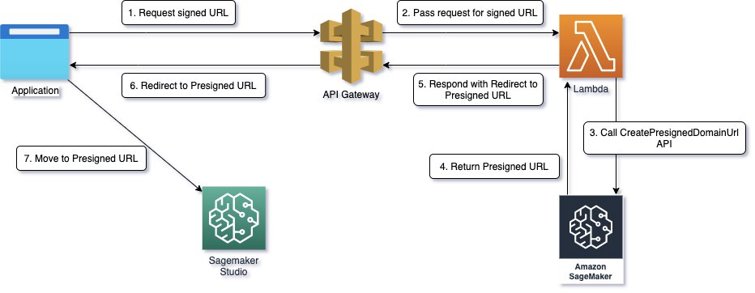
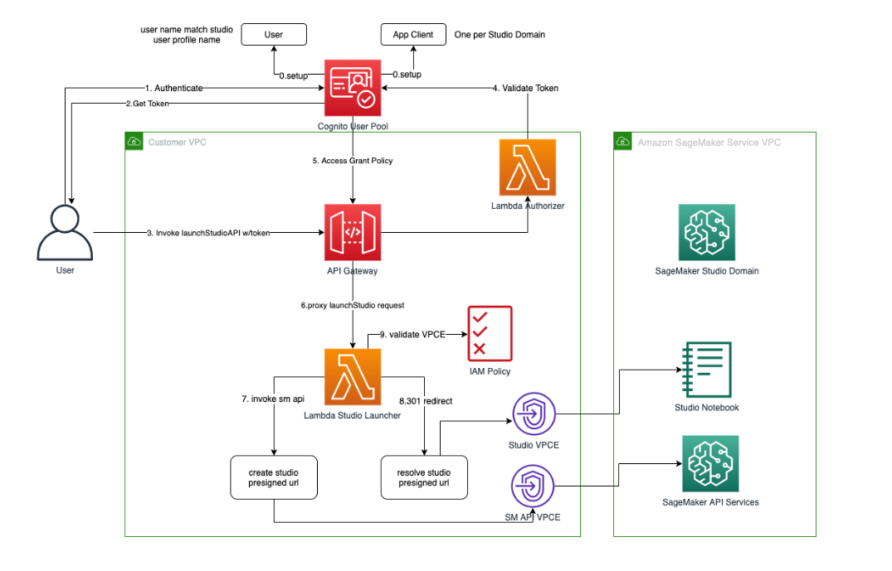

# Development Environment : Self-Study-On-SageMaker

**마지막 업데이트: 2023.06.10**


---

# 0. 용어 및 배경
- Presigned-domain-url 이란?
    - 도메인의 지정된 UserProfile에 대한 URL을 생성합니다. 웹 브라우저에서 액세스하면 사용자는 Amazon SageMaker Studio에 자동으로 로그인되고 도메인의 Amazon Elastic File System(EFS) 볼륨과 연결된 모든 앱 및 파일에 대한 액세스 권한이 부여됩니다. 이 작업은 인증 모드가 IAM과 같은 경우에만 호출할 수 있습니다.
    - 참조:  [create-presigned-domain-url](https://awscli.amazonaws.com/v2/documentation/api/latest/reference/sagemaker/create-presigned-domain-url.html)
# 1.API 로 Presigned-URL 얻은 후 런칭
- 아래 링크를 클릭하시면 AWS CLI 를 통한 런칭 방법을 알 수 있습니다. 
    - [Launch Amazon SageMaker Studio](https://docs.aws.amazon.com/sagemaker/latest/dg/studio-launch.html)
    - [CreatePresignedDomainUrl](https://docs.aws.amazon.com/sagemaker/latest/APIReference/API_CreatePresignedDomainUrl.html)
## 1.1 AWS CLI 
```
aws sagemaker create-presigned-domain-url \
--region <type region-name, e.g. us-east-1> \
--domain-id <type domain-id , e.g.d-XXXXXXX \
--user-profile-name <type user profile name, e.g. ds01 \
```
```
{
    "AuthorizedUrl": "https://d-gmzg2u9tw7ys.studio.us-east-1.sagemaker.aws/auth?token=eyJhb....."
}
```

위의 AuthorizedUrl 을 클릭하면 아래와 같이 Studio 를 론칭 함.


## 1.2. boto3 Python SDK 로 런칭
```python
import boto3

def create_sagemaker_presigned_url(studio_domain, user_profile_name, expiration=300):
    client = boto3.client('sagemaker')
    response = client.create_presigned_domain_url(
        DomainId=studio_domain,
        UserProfileName=user_profile_name,
        ExpiresInSeconds=expiration
    )
    return response['AuthorizedUrl']

# Replace 'your-studio-domain-id' and 'your-user-profile-name' with your actual values
studio_domain_id = '<type domain-id , e.g.d-XXXXXXX>' 
user_profile_name = '<type user profile name, e.g. ds01>'

# Create a pre-signed URL with a default expiration time of 1 hour
presigned_url = create_sagemaker_presigned_url(studio_domain_id, user_profile_name)

print("Pre-signed URL:", presigned_url)

```
```
Pre-signed URL: https://d-gmzg2u9tw7ys.studio.us-east-1.sagemaker.aws/auth?token=eyJhbGciOiJIUzI1NiJ9.eyJl...
```

## 1.3 관련 블로그
- (Sep 2021) Launch Amazon SageMaker Studio from external applications using presigned URLs
    - 애플리케이션에서 (1) API Gateway 에 presigned_url 요청 하고, (2) 람다함수는 create_sagemaker_presigned_url() 를 호출하여 presigned_url 를 API Gateway 제공 하고, Application 에서 사용 함.
    - [Launch Amazon SageMaker Studio from external applications using presigned URLs](https://aws.amazon.com/blogs/machine-learning/launch-amazon-sagemaker-studio-from-external-applications-using-presigned-urls/)
    - 


# 2. 보안 강화 되어 구현하기
## 2.1. 관련 가이드
- [Connect to SageMaker Studio Through an Interface VPC Endpoint](https://docs.aws.amazon.com/sagemaker/latest/dg/studio-interface-endpoint.html)
- [Connect to a Notebook Instance Through a VPC Interface Endpoint](https://docs.aws.amazon.com/sagemaker/latest/dg/notebook-interface-endpoint.html)

## 2.2. 관련 블로그
- (Jun 2022) Secure Amazon SageMaker Studio presigned URLs Part 1: Foundational infrastructure
    - 이 블로그는 아래와 같은 내용을 설명 합니다. 
    - Studio 사용자가 노트북 링크를 열면 Studio는 연동 사용자의 IAM 정책을 검증하여 액세스 권한을 부여하고 사용자를 위해 Pre-signed URL을 생성 및 확인합니다. SageMaker 콘솔은 인터넷 도메인에서 실행되기 때문에 이렇게 생성된 Pre-signed URL은 브라우저 세션에서 볼 수 있습니다. 이는 적절한 액세스 제어가 시행되지 않을 때 고객 데이터에 대한 액세스 및 유출에 대한 바람직하지 않은 위협 벡터를 나타냅니다.
    - Studio Pre-signed URL을 보호하기 위한 전반적인 아키텍처에 대해 논의하고 인터넷을 통과하지 않고 사설 네트워크를 통해 VPC 엔드포인트를 통해 Studio Pre-signed URL을 생성하고 실행하기 위한 기본 인프라를 설정하는 방법을 시연합니다. 이는 Studio Pre-signed URL에 대한 액세스 권한과 회사 환경 내에서 무단 또는 스푸핑된 회사 사용자 액세스 권한을 획득한 외부 악의적 행위자에 의한 데이터 유출을 방지하기 위한 기본 계층 역할을 합니다.
    - [Secure Amazon SageMaker Studio presigned URLs Part 1: Foundational infrastructure](https://aws.amazon.com/blogs/machine-learning/secure-amazon-sagemaker-studio-presigned-urls-part-1-foundational-infrastructure/)
    - 
    * 솔루선 단계
        * (1) 유저는 온프레미스 ldP 를 사용하여 기업 포탈에 접근을 하고, “Studio link” 를 클릭
        * (2) 기업 포탈 애플리케이션은 API Gateway VPC endpoint 를 이용하여 “Create a Presigned URL” 을 호출한다.
        * (3) API Gateway VPC endpoint call (“create presigned URL” )  은 custom vpc 안에 있는 Route53 전송된다.
        * (4) VPC DNS 는 API Gateway VPC endpoint IP 로 변환 한다.
        * (5) API Gateway VPCE 는 요청을 API Gateway service account 로 보내서, “create presigned URL API” 를 처리하게 합니다.
        * (6) API Gateway “create-pre-signedURL” 을 처리하는 람다 함수를 호출 합니다.
        * (7) 람다 함수는 Lambda VPC endpoint 를 통하여 호출이 됩니다
        * (8) 람다 함수는 SageMaker domain and user profile 를 확인하고 sagemaker createpre-signedDomainURL 함수를 콜 합니다.
        * (9) 생성돤 presigned URL 은 Studio VPCE 에게 확인이 됩니다.
        * (10) 스튜디오는 presigned URL 이 customer’s VPC endpoint 에서 접근했는지를 확인 합니다.
        * (11) 스튜디오 노트북은 퍼블릭 인터넷에 노출하지 않고, 기업 네트워크를 통하여 유저의 브라우저 세션으로 제공됩니다.
- (Jun 2022) Secure Amazon SageMaker Studio presigned URLs Part 2: Private API with JWT authentication
    - Amazon SageMaker Pre-signed URL을 생성하고 액세스하기 위한 프록시 인터페이스로 Amazon API Gateway를 통해 프라이빗 API Gateway를 구축하는 방법. 또한 회사 네트워크 내에서 인증된 최종 사용자에 대해서만 Pre-signed URL이 생성되고 액세스되도록 추가 가드레일을 추가합니다.
    - [Secure Amazon SageMaker Studio presigned URLs Part 2: Private API with JWT authentication](https://aws.amazon.com/blogs/machine-learning/secure-amazon-sagemaker-studio-presigned-urls-part-2-private-api-with-jwt-authentication/)
    - 
        * 코그니토에 “유저아이디”, “세이지 메이커 유저 프로파일” 로 등록
        * 유저의 온프레미스 인증(ldP과 코그니티와 함께 인증을 함.
        * 인증이 성공하면 “access grant policy with studio user profile id” 를 발행 받음
        * 람다 함수는 createStudioPresignedUrl 를 호출하여  presigned URL 를 생성함.
        * 유저는 Studio VPCE 통하여 스튜디오 노트북을 접근한다. 
        * 람다 함수의 IAM Policy 는 유저가 스튜디오 노트북 접근을 VPCE 로 접근하는지 확인한다.


