# SageMaker Feature Store

**마지막 업데이트: 2023.01.02**

---
SageMaker Feature Store 스스로 공부할 수 있는 링크 및 설명을 제공 합니다. 자세한 사항은 참조의 블로그 및 기타 링크를 확인 부탁 합니다.

---

# 1. 주요 가이드

- 김대근님의 피처 스토어 오버뷰는 직관적으로 그림과 함께 설명을 잘 하고 있습니다. 먼저 한번 보시고 다른 아래의 컨텐츠를 확인 하세요.
    - [Amazon SageMaker Feature Store Overview (김대근님 노션)](https://daekeun.notion.site/Amazon-SageMaker-Feature-Store-Overview-448610b88ae4403181151fd56aac7e0c)
- SageMaker Feature Store 개발자 가이드 입니다. 아래 그림은 기본적인 개념도 입니다. 
    - [SageMaker 개발자 가이드](https://docs.aws.amazon.com/sagemaker/latest/dg/feature-store.html)
    - 아래는 기본적인 피처 스토어의 개념도를 보이고 있습니다.
    - 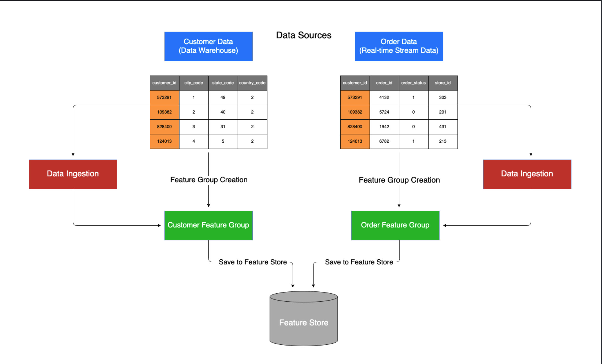

# 2. 주요 실습 코드
- [Feature Store Immersion Day](https://catalog.us-east-1.prod.workshops.aws/workshops/5c093162-c9ce-4203-ab35-0b94ca950ee8/en-US)
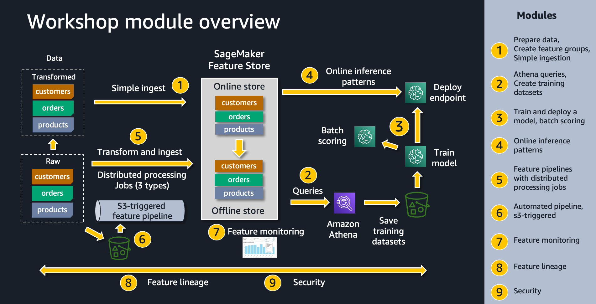
- [Other Notebook Examples](https://docs.aws.amazon.com/sagemaker/latest/dg/feature-store-notebooks.html)

# 3. 블로그
최신 블로그 순서로 정리되어 있습니다. 처음 접근하시는 분은 가장 아래에서 부터 보시면 좋습니다.

- [(Dec 2022) Speed ML development using SageMaker Feature Store and Apache Iceberg offline store compaction](https://aws.amazon.com/blogs/machine-learning/speed-ml-development-using-sagemaker-feature-store-and-apache-iceberg-offline-store-compaction/)
    - Apache Iceberg 의 Table Format 을 제공 출시 및 설명을 다루고 있습니다.
    - 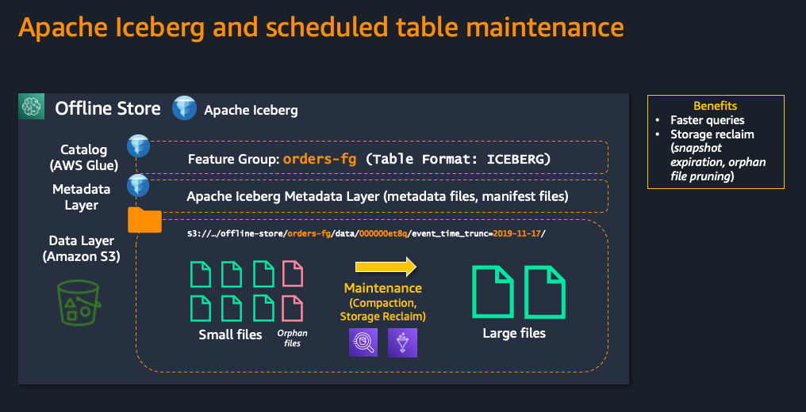
- [(Aug 2022) Promote feature discovery and reuse across your organization using Amazon SageMaker Feature Store and its feature-level metadata capability](https://aws.amazon.com/blogs/machine-learning/promote-feature-discovery-and-reuse-across-your-organization-using-amazon-sagemaker-feature-store-and-its-feature-level-metadata-capability/)
    - 메타 정보(예: 피처 이름, 등록 시간 등) 로 쉽게 피처 검색에 관련된 내용 입니다.
    - 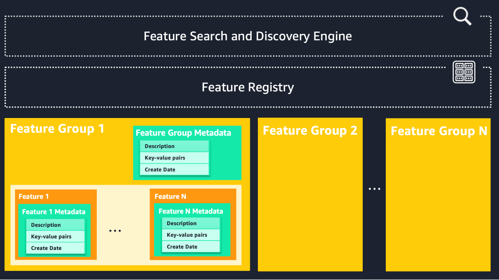
- [(Aug 2022) Simplify iterative machine learning model development by adding features to existing feature groups in Amazon SageMaker Feature Store](https://aws.amazon.com/blogs/machine-learning/simplify-iterative-machine-learning-model-development-by-adding-features-to-existing-feature-groups-in-amazon-sagemaker-feature-store/)
    - 기존에 Record 에 추가적인 피처 컬럼을 생성(업데이트)할 수 있게 합니다. 
    - 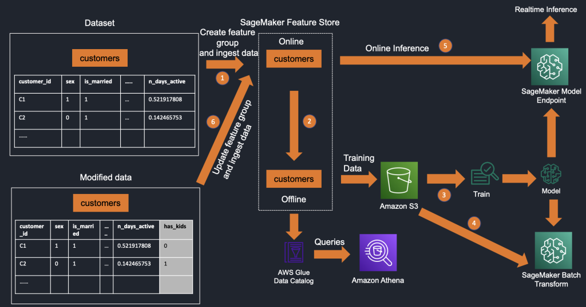
- [(Jun 2022) Accelerate and improve recommender system training and predictions using Amazon SageMaker Feature Store](https://aws.amazon.com/ko/blogs/machine-learning/accelerate-and-improve-recommender-system-training-and-predictions-using-amazon-sagemaker-feature-store/)
    - 추천 모델 및 추론시에 피처 스토어를 사용하는 예시 입니다.
    - 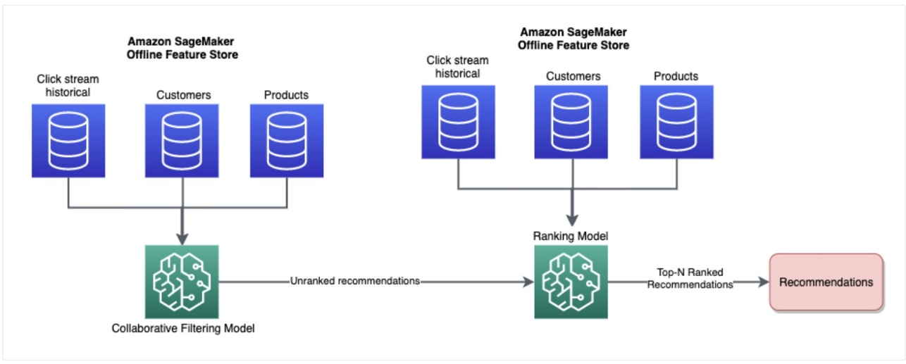
- [(Jun 2022) Easily create and store features in Amazon SageMaker without code](https://aws.amazon.com/blogs/machine-learning/easily-create-and-store-features-in-amazon-sagemaker-without-code/)
    - Data Wrangler 를 통한 피처 스토어 저장을 쉽게 할 수 있는 블로그 입니다.
    - 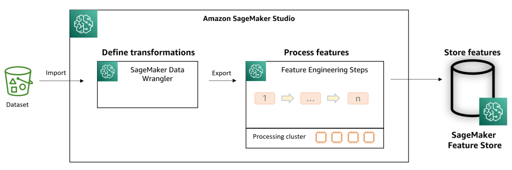
- [(Apr 2022) Control access to Amazon SageMaker Feature Store offline using AWS Lake Formation](https://aws.amazon.com/blogs/machine-learning/control-access-to-amazon-sagemaker-feature-store-offline-using-aws-lake-formation/)
    - Lake Formation 을 통한 오프라인 피처 스토어 사용에 대한 블로그 입니다.
    - 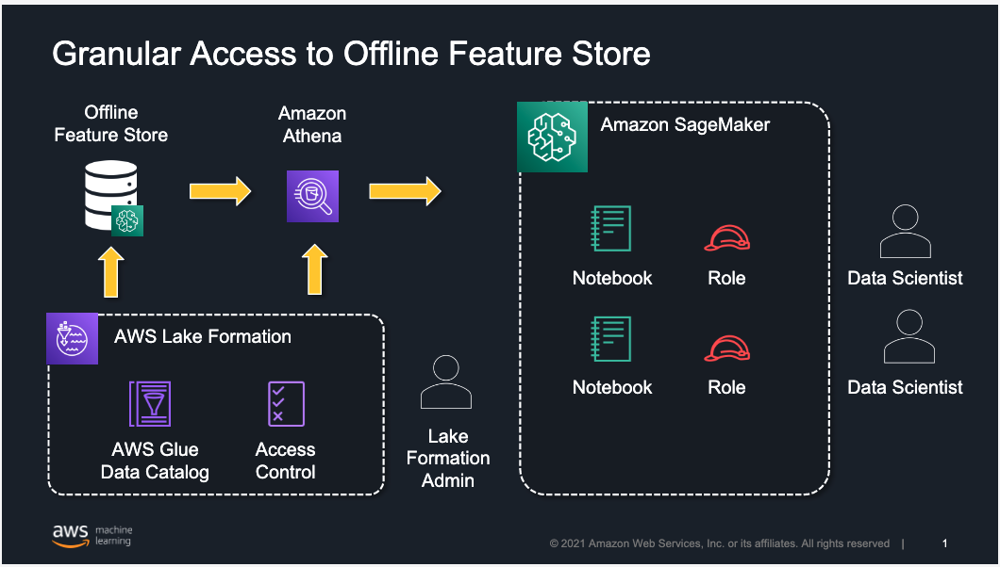
- [(Oct 2021) Extend model lineage to include ML features using Amazon SageMaker Feature Store](https://aws.amazon.com/blogs/machine-learning/extend-model-lineage-to-include-ml-features-using-amazon-sagemaker-feature-store/)
    - ML 리니지 (히스토리 추적)에 대한 블로그 입니다.
    - [ML-6028-image001.png](img/ML-6028-image001.png)
- [(Sep 2021) Scale ML feature ingestion using Amazon SageMaker Feature Store](https://aws.amazon.com/ko/blogs/machine-learning/scale-ml-feature-ingestion-using-amazon-sagemaker-feature-store/)
    - 대용량의 피처 저장에 대한 블로그 입니다.
    - 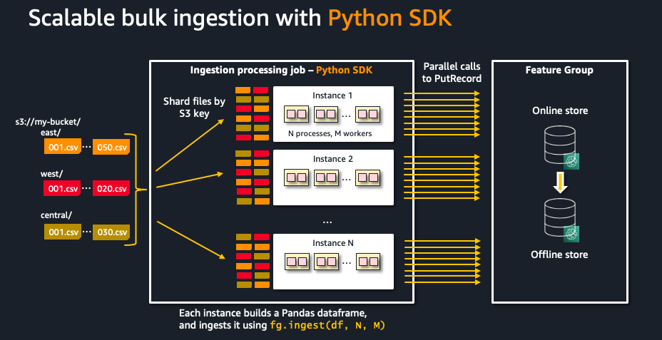
- [(Aug 2021) Getting started with Amazon SageMaker Feature Store](https://aws.amazon.com/blogs/machine-learning/getting-started-with-amazon-sagemaker-feature-store/)
    - 피처 스토어의 시작 블로그 입니다.
    - 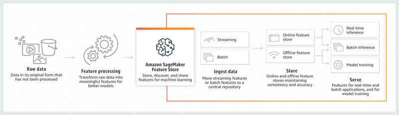
- [(Jun 2021) Build accurate ML training datasets using point-in-time queries with Amazon SageMaker Feature Store and Apache Spark](https://aws.amazon.com/blogs/machine-learning/build-accurate-ml-training-datasets-using-point-in-time-queries-with-amazon-sagemaker-feature-store-and-apache-spark/)
    - Apache Spark 를 통한 피처 스토어 사용 가이드 입니다.
    - 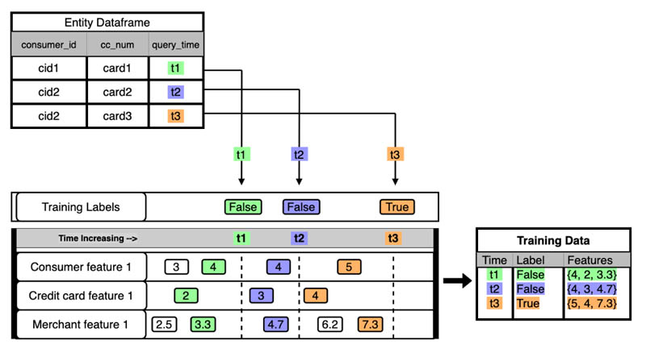
- [(Mar 2021) Enable feature reuse across accounts and teams using Amazon SageMaker Feature Store](https://aws.amazon.com/blogs/machine-learning/enable-feature-reuse-across-accounts-and-teams-using-amazon-sagemaker-feature-store/)
    - 기업의 서로 다른 부서에서 피처 스토어를 사용하는 아키텍처 패턴의 가이드 입니다.
    - 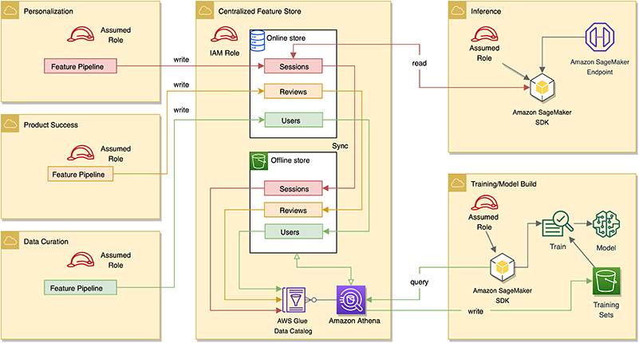
- [(Jan 2021) Understanding the key capabilities of Amazon SageMaker Feature Store](https://aws.amazon.com/blogs/machine-learning/understanding-the-key-capabilities-of-amazon-sagemaker-feature-store/)
    - 피처 스토어의 연계 서비스 및 주요 특징을 다루고 있습니다.
    - 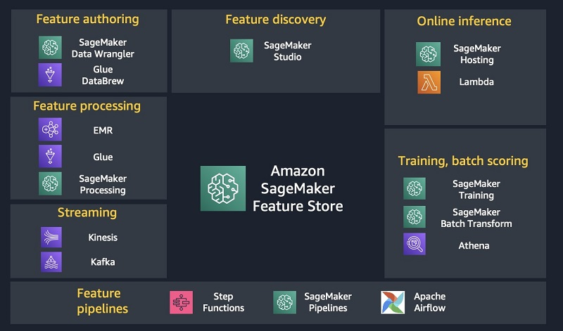
- [(Dec 2020) Using streaming ingestion with Amazon SageMaker Feature Store to make ML-backed decisions in near-real time](https://aws.amazon.com/blogs/machine-learning/using-streaming-ingestion-with-amazon-sagemaker-feature-store-to-make-ml-backed-decisions-in-near-real-time/)
    - 사기 탐지 모델의 예시를 통한 실시간 추론시 온라인 피처 스토어의 사용 예시를 다룹니다.
    - 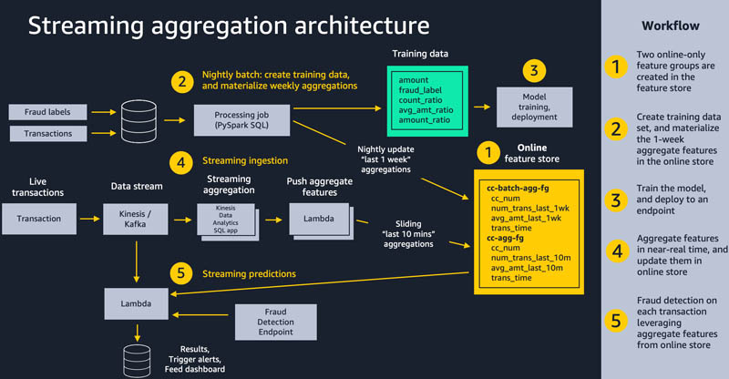

