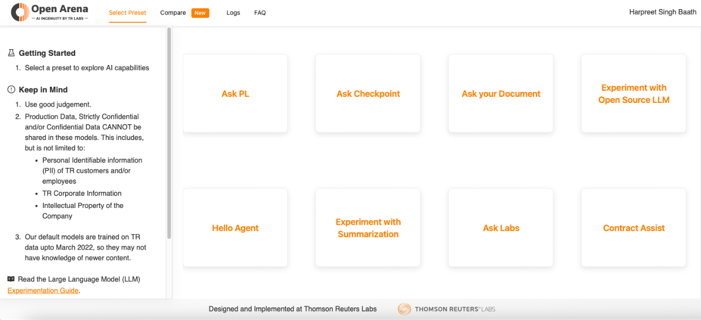
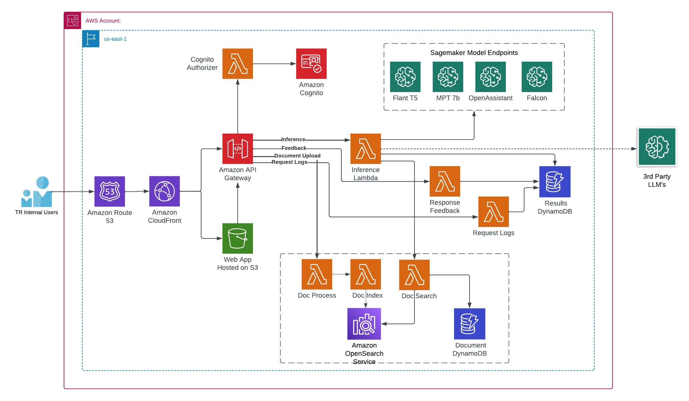

# Generative AI

**마지막 업데이트: 2023.08.19**

---
이 페이지는 유익한 블로그의 간단한 요약을 제공 합니다.
---

- (Blog, Aug 2023) [How Thomson Reuters developed Open Arena, an enterprise-grade large language model playground, in under 6 weeks](https://aws.amazon.com/blogs/machine-learning/how-thomson-reuters-developed-open-arena-an-enterprise-grade-large-language-model-playground-in-under-6-weeks/)
    - AWS와 공동으로 개발한 Thomson Reuters의 전사적 대규모 언어 모델(LLM) 플레이그라운드인 Open Arena를 만든 방법을 설명하고 있습니다. 아래 그림은 일반 유저가 아래와 같은 UI 에 들어와서, 테스트를 할 수 있고, 머신러닝 엔지니어는 "보안" 허용된 네트워크안에서 "Fine-Tuning" 을 하여 최신 모델을 배포하는 등의 시스템을 지속적으로 개선하고 있습니다.
    - 
    - 아래는 위 UI 를 구현한 System Architectue 입니다.
    - 
- (Blog, Jul 2023) [Preview – Enable Foundation Models to Complete Tasks With Agents for Amazon Bedrock](https://aws.amazon.com/blogs/aws/preview-enable-foundation-models-to-complete-tasks-with-agents-for-amazon-bedrock/)
    - Amazon Bedrock용 에이전트를 사용하면 소매 주문 관리 또는 보험 청구 처리와 같은 내부 또는 외부 고객을 위한 작업을 자동화할 수 있습니다. 예를 들어 에이전트 기반 생성 AI 전자 상거래 애플리케이션은 "이 재킷이 파란색입니까?"라는 질문에만 응답할 수 없습니다. 간단한 답변으로 주문을 업데이트하거나 교환을 관리하는 작업에 도움을 줄 수 있습니다. 이것이 작동하려면 먼저 에이전트에 외부 데이터 소스에 대한 액세스 권한을 부여하고 이를 다른 애플리케이션의 기존 API에 연결해야 합니다. 이를 통해 에이전트가 더 넓은 세계와 상호 작용하고 단순한 언어 처리 작업 이상으로 유틸리티를 확장할 수 있도록 하는 FM을 사용할 수 있습니다.
    - (1) 아래는 보험 청구가 진행 중이거나, 문서 작업이 지연이 되고 있는 보험 고객에게 "리마인더" 를 보내라고 명령을 하고, (2) 현재 보험 청구의 내용을 내부 기업 시스템에서 조회하고, 또한 "리마인데" 를 보낸 다음의 상태를 보여 주고 있습니다.
    - 
