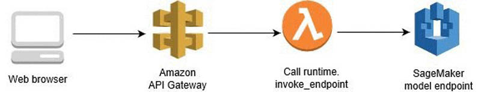
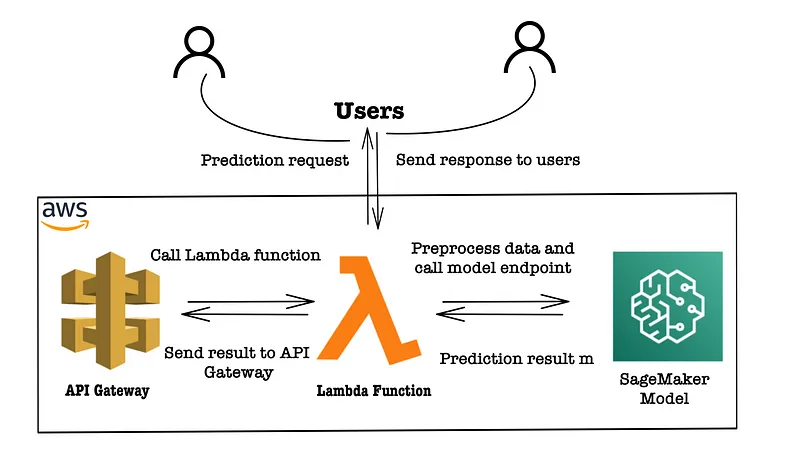
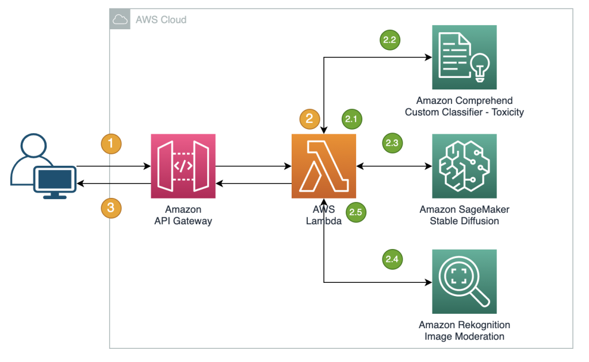
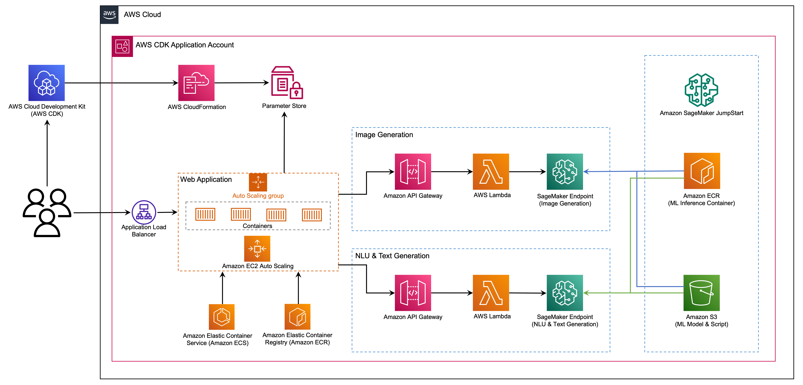
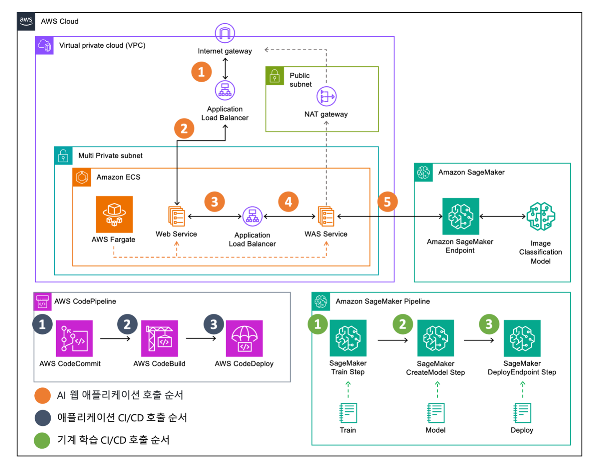

# Inference with Application : Self-Study-On-SageMaker

**마지막 업데이트: 2023.07.18**

---

# 1. 개발자 가이드
- 아래 개발자 가이드는 SageMaker Endpoint 의 배포에 해당하는 가이드 입니다. 
    - [Create your endpoint and deploy your model](https://docs.aws.amazon.com/sagemaker/latest/dg/realtime-endpoints-deployment.html)

# 2. 추천 블로그
- (Dec 2022, 수준: 초급) [Call an Amazon SageMaker model endpoint using Amazon API Gateway and AWS Lambda](https://aws.amazon.com/blogs/machine-learning/call-an-amazon-sagemaker-model-endpoint-using-amazon-api-gateway-and-aws-lambda/)
    - 이 게시물에서는 API Gateway 및 Lambda를 사용하여 SageMaker에서 배포한 모델 엔드포인트를 호출하는 방법을 보여줍니다.
    - 
- (Jul 2022, 수준: 중급) [Call an Amazon SageMaker model endpoint using Amazon API Gateway and AWS Lambda. Step-by-Step tutorial](https://medium.com/@data.science.enthusiast/invoke-sagemaker-model-endpoint-with-aws-api-gateway-and-lambda-3d0c085dccb8)
    - 이 문서는 AWS 서비스를 통해 배포하여 ML 모델의 API 프로덕션화의 기본 사항을 얻는 데 도움이 됩니다. 좋은 시작이 될 수 있으며 이후에 확장할 수 있습니다.
    - 
- (June 2023, 수준: 중급) [Safe image generation and diffusion models with Amazon AI content moderation services](https://aws.amazon.com/blogs/machine-learning/safe-image-generation-and-diffusion-models-with-amazon-ai-content-moderation-services/)
    - 이 게시물에서는 AWS AI 서비스 Amazon Rekognition 및 Amazon Comprehend를 다른 기술과 함께 사용하여 거의 실시간으로 Stable Diffusion 모델 생성 콘텐츠를 효과적으로 조정하는 방법을 살펴봅니다. 
    - 
- (May 2023, 수준: 고급) [Deploy generative AI models from Amazon SageMaker JumpStart using the AWS CDK](https://aws.amazon.com/blogs/machine-learning/deploy-generative-ai-models-from-amazon-sagemaker-jumpstart-using-the-aws-cdk/)
    - 이 게시물에서는 AWS Cloud Development Kit(AWS CDK)를 사용하여 JumpStart에서 이미지 및 텍스트 생성 AI 모델을 배포하는 방법을 보여줍니다. AWS CDK는 Python과 같은 친숙한 프로그래밍 언어를 사용하여 클라우드 애플리케이션 리소스를 정의하는 오픈 소스 소프트웨어 개발 프레임워크입니다.
    - 
- (July 2023, 수준: 고급) [Amazon ECS와 Amazon SageMaker를 이용하여 이미지 분류 AI 웹 애플리케이션 구축과 운영하기](https://aws.amazon.com/ko/blogs/tech/ai-application-ecs-sagemaker/)
    - 이번 글에서는 Amazon ECS와 Amazon SageMaker를 이용해서 AI 웹 애플리케이션을 마이크로서비스 아키텍처(MSA)로 구축하는 방법을 소개합니다. 이를 통해서 컨테이너 기반 마이크로서비스 아키텍처를 구성하는 방법을 배우고 트래픽 수요에 따른 인프라 관리와 운영을 자동화할 수 있습니다. 그리고 기계 학습 모델을 학습하고 배포하는 방법을 통해서 이미지 분류를 위한 AI 기능을 제공하는 방법을 배울 수 있습니다
    - 

