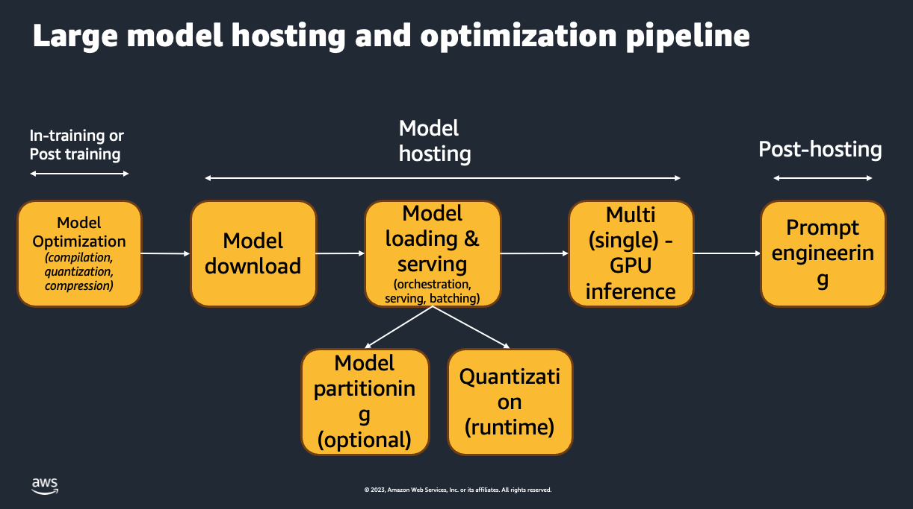
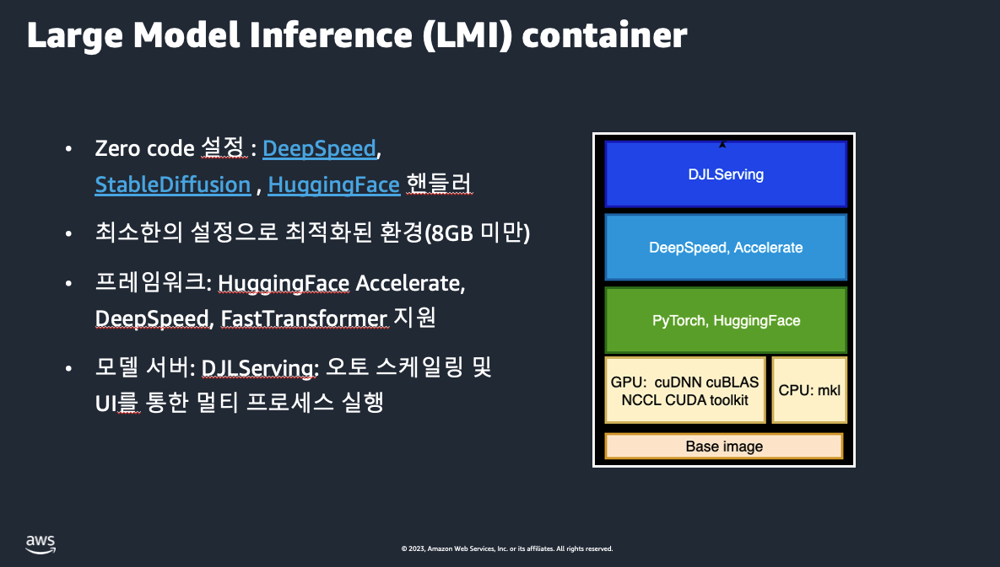
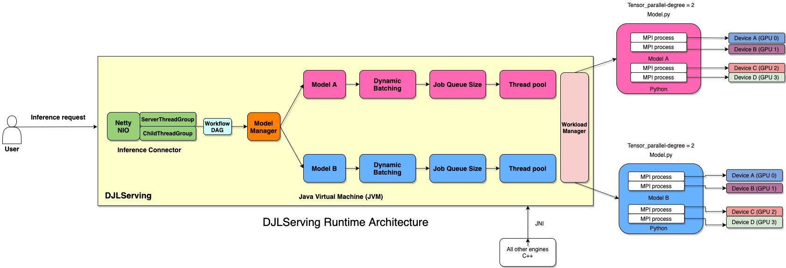
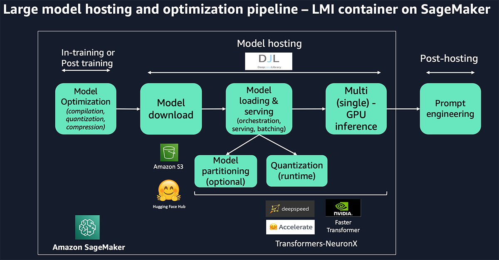
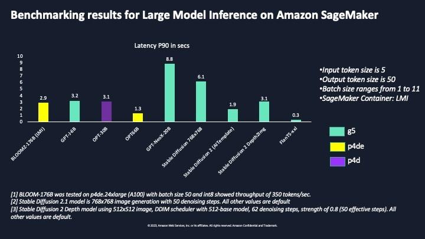

# Foundation Model Inference : Self-Study-On-SageMaker

**마지막 업데이트: 2023.07.18**

---

# 1. Foundation Model (FM) 추론
FM 모델은 아래의 그림의 단계와 같이 모델 서빙 단계를 가지게 됩니다. 
- (1) 모델 훈련 동안 혹은 모델 훈련이 완료 된 후에 "최적화된 모델" 을 생성 합니다.
- (2) GPU 인스턴스 (예: mㅣ.g5.12xlarge) 에 모델 가중치 및 필요한 아티펙티를 다운로드 합니다.
- (3) 모델을 로딩 및 서빙 합니다. (이때 모델 네트워크를 분절하여 여러개의 GPU에 분산하거나, 양자화(Quantization) 을 합니다.)
- (4) 여러개의 GPU 혹은 단일 GPU 로 모델 서빙을 합니다
- (5) Post-hosting 으로 "프로프트, Prompt" 를 생성하여 모델을 추론 합니다.
- 

FM 모델의 추론을 하기위한 SageMaker 에서 제공하는 도커 컨테이너이고, 아래 가장 상위 레이어의 이름인 DJL Serving 이라고 불리웁니다.

# 2. 개발자 가이드
- 개발자 가이드로서 Large Model 에 대한 "추론 도커 컨테이너", "세이지 메이커 엔드포인트 파라미터", "설정 및 세팅", "올바른 GPU 인스턴스 타입 결정", "FAQ", "Trouble Shooting" 에 대한 내용이 있습니다. 
    - [Model parallelism and large model inference](https://docs.amazonaws.cn/en_us/sagemaker/latest/dg/large-model-inference.html)

# 3. 추천 블로그
- (Sep 2022, 수준: 중급) [Deploy large models on Amazon SageMaker using DJLServing and DeepSpeed model parallel inference](https://aws.amazon.com/blogs/machine-learning/deploy-large-models-on-amazon-sagemaker-using-djlserving-and-deepspeed-model-parallel-inference/)
    - GPT-J-6B 모델을 DeepSpeed 엔진 및 Tensor Parallelism 을 사용하여 FM 배포를 SageMaker 에서 하는 블로그 입니다.
    - 
- (Apr 2023, 수준: 고급) [Deploy large models at high performance using FasterTransformer on Amazon SageMaker](https://aws.amazon.com/blogs/machine-learning/deploy-large-models-at-high-performance-using-fastertransformer-on-amazon-sagemaker/)
    - 이 블로그는 모델을 배포하기 전에 성능을 높이는 데 사용할 수 있는 다양한 유형의 모델 최적화에 대해 논의합니다. 그런 다음 Amazon SageMaker 대형 모델 추론 딥 러닝 컨테이너(LMI DLC)가 최적화 및 배포에 어떻게 도움이 되는지 강조합니다. 마지막으로 LMI DLC 및 FasterTransformer 모델 병렬 처리를 사용하여 flan-t5-xxl 및 flan-ul2와 같은 모델을 배포하는 코드 예제를 제공합니다.
    - 
- (Apr 2023, 수준: 고급) [Deploy BLOOM-176B and OPT-30B on Amazon SageMaker with large model inference Deep Learning Containers and DeepSpeed](https://aws.amazon.com/blogs/machine-learning/deploy-bloom-176b-and-opt-30b-on-amazon-sagemaker-with-large-model-inference-deep-learning-containers-and-deepspeed/)
    - 이 게시물에서는 새로운 SageMaker 대형 모델 추론 DLC를 사용하여 가장 인기 있는 두 개의 대형 NLP 모델인 Hugging Face 리포지토리에서 BigScience의 BLOOM-176B 및 Meta의 OPT-30B를 배포합니다. 특히 DeepSpeed의 DJL(Deep Java Library) 서빙 및 텐서 병렬 처리 기술을 사용하여 텍스트 생성 사용 사례에서 토큰당 0.1초의 대기 시간을 달성합니다.
    - 

- (Jun 2023, 수준: 중급) [Deploy Falcon-40B with large model inference DLCs on Amazon SageMaker](https://aws.amazon.com/blogs/machine-learning/deploy-falcon-40b-with-large-model-inference-dlcs-on-amazon-sagemaker/)
    - 이 블로그는 LMI DLC를 사용하여 SageMaker에서 DeepSpeed를 사용하여 Falcon-40B를 호스팅하는 방법을 안내합니다. Falcon-40B는 여러 A10 GPU를 사용해야 하는 반면 Falcon-7B는 단일 GPU만 필요합니다. DeepSpeed와 Accelerate를 모두 사용하여 호스트 Falcon-40B 및 Falcon-7B를 참조할 수 있는 예제도 준비했습니다.
