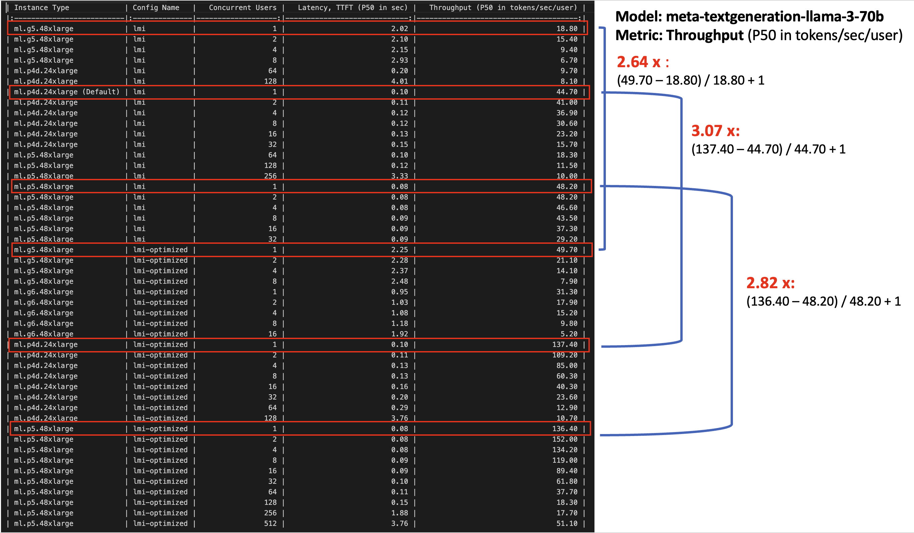

# SageMaker Inference Optimization : Self-Study-On-SageMaker

**마지막 업데이트: 2024.07.21**

---

# 1. Speculative Decoding, Quantization and Compilation
2024년 7월에 새롭게 SageMaker Inference Optimization 이 출시 되었습니다. 크게 Speculative Decoding, Quantization and Compilation 3가지의 방법이 소개 되었고, 자세한 사항은 아래 블로그를 참조 하세요. 
- 가장 핵심이 되는 벤치 마킹의 결과가 아래 처럼 테스트 되었습니다. Model 은 meta-textgeneration-llama-3-70b 을 사용하였고, 
Throughput (P50 in tokens/sec/user) Metric 기준으로 계산 해보았습니다. ml.g5.48xlarge 는 기존의 18.80 에서 49.70 의 Throughput 이 나와서 2.64 배, ml.p4d.24xlarge 는 3.07 배, ml.p5.48xlarge 는 2.82 배가 향상이 되었습니다. 

    - 
- Blog: July 2024 - [Achieve up to ~2x higher throughput while reducing costs by ~50% for generative AI inference on Amazon SageMaker with the new inference optimization toolkit – Part 1](https://aws.amazon.com/blogs/machine-learning/achieve-up-to-2x-higher-throughput-while-reducing-costs-by-50-for-generative-ai-inference-on-amazon-sagemaker-with-the-new-inference-optimization-toolkit-part-1/)
- Blog: July 2024 - [Achieve up to ~2x higher throughput while reducing costs by ~50% for generative AI inference on Amazon SageMaker with the new inference optimization toolkit – Part 2](https://aws.amazon.com/blogs/machine-learning/achieve-up-to-2x-higher-throughput-while-reducing-costs-by-up-to-50-for-generative-ai-inference-on-amazon-sagemaker-with-the-new-inference-optimization-toolkit-part-2/)
- 위의 블로그에서 언급된 Code 이고, 또한 실행된 코드 결과 입니다. 코드 실행 결과를 보시면 좋습니다. (실행시에 각각 한개씩의 ml.p4d.24xlarge, ml.inf2.48xlarge for endpoint usage 가 필요 합니다.)
    - Code: [SageMaker Python SDK Code](https://github.com/aws-samples/sagemaker-genai-hosting-examples/tree/main/Llama3)
    - 실행 결과: [llama3-70b-js-optimized-deployment.ipynb](https://github.com/gonsoomoon-ml/sagemaker-genai-hosting-examples/blob/main/Llama3/llama3-70b/llama3-70b-js-optimized-deployment.ipynb)
