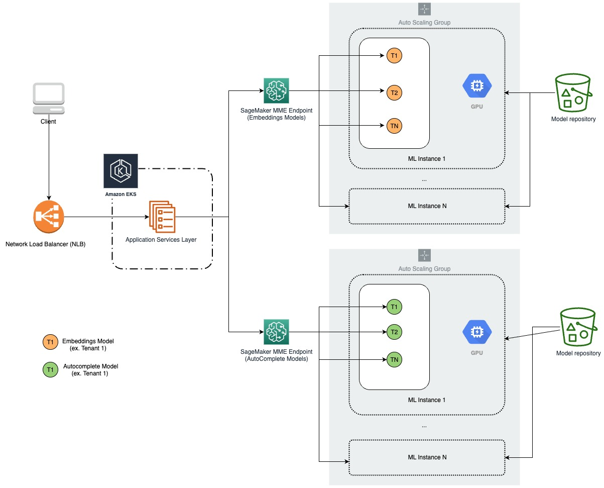
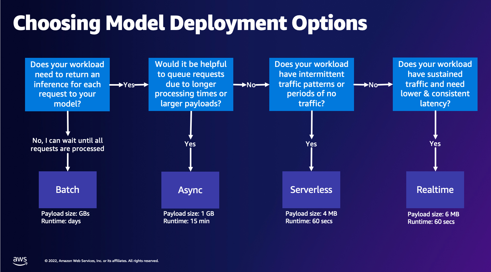
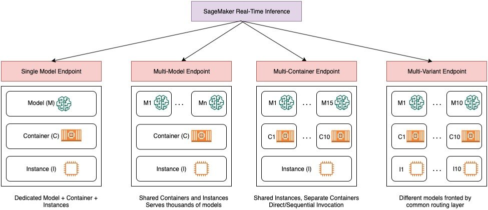
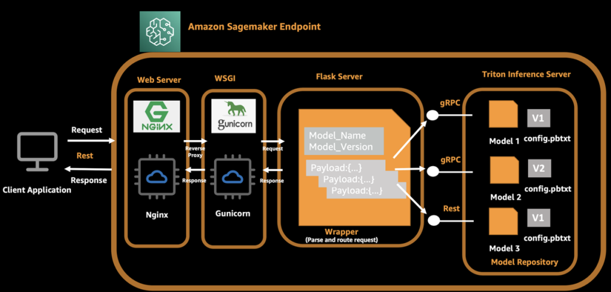

# Inference : Self-Study-On-SageMaker

**마지막 업데이트: 2023.07.20**

---

## * [New : Foundation Model (FM) 배포 및 추론](FM-README.md)
## * [New : Inference with Appliacton](Application-README.md)

# 0. 세이지 메이커 배포 및 추론 입문
- 전반적인 추론 과정의 전체와 아키텍처를 잘 설명 합니다.
    - [High-Performance & Cost-Effective Model Deployment Strategies with Amazon SageMaker](https://www.youtube.com/watch?v=_-hX-2MqiOg)

# 1. 워크샵 자료
## 1.1 모델 서빙 페턴  가이드

* 다양한 모델 서빙 패턴, A/B 테스팅 에 대한 설명 및 핸즈온 자료 링크가 있습니다.
    * https://main.dczm1kv9dpvdi.amplifyapp.com/ko/
    
    
# 2. 추천 블로그
- (Jun 2023, 수준: 고급) [How Forethought saves over 66% in costs for generative AI models using Amazon SageMaker](https://aws.amazon.com/blogs/machine-learning/how-forethought-saves-over-66-in-costs-for-generative-ai-models-using-amazon-sagemaker/?sc_channel=sm&sc_campaign=Machine_Learning&sc_publisher=LINKEDIN&sc_geo=GLOBAL&sc_outcome=awareness&trk=machine_learning&linkId=220118422)
    - Embedding Models, AutoComplete Models 을 EKS 에서 배포해서 사용하다가 SageMaker Multi-Model-Endpoint(MME) 로 마이그레이션을 한 블로그 입니다. SageMaker Endpoint 의 Triton Server 를 통하여 MME 를 구현한 사례 입니다.
    - 
    
- (Nov 2022, 수준: 중급) [Getting started with deploying real-time models on Amazon SageMaker](https://aws.amazon.com/blogs/machine-learning/getting-started-with-deploying-real-time-models-on-amazon-sagemaker/) 
    - 전체적인 SageMaker 의 추론 옵션을 설명을 하고 있음. 
    - 또한 프로그래밍 관점에서  SageMaker Python SDK 와 AWS SDK/Boto3 의 차이점을 기술 함.
        - SageMaker Python SDK
            - 빠르게 실험의 용도로 사용. Estimator.deploy() 만으로 엔드포인트 생성
        - AWS SDK/Boto3
            - 프로덕션 용으로 사용을 권장하면, Model Creation, Endpoint Configuration Creation, and Endpoint Creation 세개의 단계로 이루어짐.            
    - 
- (Nov 2022, 수준: 중급) [Model Hosting Patterns in SageMaker: Best practices in testing and updating models on SageMaker](https://aws.amazon.com/blogs/machine-learning/model-hosting-patterns-in-sagemaker-best-practices-in-testing-and-updating-models-on-sagemaker/)
    - 세이지 메이커에서 Real time Endpoint 를 Model Hosting Pattern 으로 정리한 블로그 임. 이 중에서 Multi-Variant Endpoint 에 대한 장/단점, AB 테스팅 및  베스트 프랙티스를 잘 설명 함. 
    - 
    
    
# 3. 허깅 페이스 모델 배포 및 추론

## 3.1. 공식 튜토리얼
- 아래 허깅페이스 공식 자료는 아래와 같은 내용을 소개 하고 있습니다.
    - Deploy a 🤗 Transformers model trained in SageMaker.
    - Deploy a 🤗 Transformers model from the Hugging Face 
    - Run a Batch Transform Job using 🤗 Transformers and Amazon SageMaker.
    - Create a custom inference module.
- [Deploy models to Amazon SageMaker](https://huggingface.co/docs/sagemaker/inference)
   
# 4. Triton Inference Server on SageMaker Endpoint
- [강추] 아래는 Triton 을 SageMaker Endpoint 에 Step By Step 으로 실습할 수 있는 코드 입니다.
    - [Triton Inference Server on SageMaker Endpoint](https://github.com/gonsoomoon-ml/Neural-Collaborative-Filtering-On-SageMaker/tree/main/2_Triton_Inference)
- (Nov 2022, 수준: 고급) [Serve multiple models with Amazon SageMaker and Triton Inference Server](https://aws.amazon.com/blogs/machine-learning/serve-multiple-models-with-amazon-sagemaker-and-triton-inference-server/)
    - 하나의 SageMaker Endpoint 에서 NVIDIA Triton Inference Server 에 3개의 모델을 동시에 서빙하는 예시 임.
    - 
    
# 4. Bring Your Own Model (BYOM) 
- 다른 곳에서 모델을 학습한 후에 SageMaker 에서 모델을 호스팅 하는 예제 입니다.
    - [Amazon SageMaker XGBoost Bring Your Own Model](https://github.com/aws/amazon-sagemaker-examples/tree/main/advanced_functionality/xgboost_bring_your_own_model)
    
    
# 5. Bring Your Own Inference Container (BYOC)
- 아래는 BYOC 를 잘 설명하는 블로그 입니다.
    - [Amazon SageMaker 기반 컨테이너를 활용한 Scikit-Learn 모델 훈련 및 호스팅 방법](https://aws.amazon.com/ko/blogs/korea/train-and-host-scikit-learn-models-in-amazon-sagemaker-by-building-a-scikit-docker-container/)
        - Scikit-Learn 의 BYOC 예제 코드 입니다.
            - [Scikit-Learn, BYOC](https://github.com/aws/amazon-sagemaker-examples/tree/main/advanced_functionality/scikit_bring_your_own)    
    - [Why Bring Your Own Container to Amazon SageMaker and How to do it right !](https://medium.com/@pandey.vikesh/why-bring-your-own-container-to-amazon-sagemaker-and-how-to-do-it-right-bc158fe41ed1)
- 아래는 Inference, training docker container 를 기술하고 있고, SageMaker Inference Toolkit 를 참조 하시면 됩니다.
    - [Adapting your own Docker container to work with SageMaker](https://docs.aws.amazon.com/sagemaker/latest/dg/docker-containers-adapt-your-own.html)
- 아래는 본인의 추론 컨테이너를 SageMaker 에 맞게 수정하는 작업을 설명 합니다.
    - [Adapting Your Own Inference Container](https://docs.aws.amazon.com/sagemaker/latest/dg/adapt-inference-container.html)
- 아래는 추천 알고리즘 (NCF) 를 호스팅하기 위해서 기존의 PyTorch Docker Image 를 베이스로 해서 Extension 하여 사용자 정의 도커 이미지를 만드는 예제 입니다.
    - [Extend PyTorch Inference Container](https://github.com/aws-samples/aws-ai-ml-workshop-kr/tree/master/sagemaker/recommendation/Neural-Collaborative-Filtering-On-SageMaker/2_Inference)    
