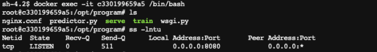

# BYOC-Scikit 분석  : Self-Study-On-SageMaker

**마지막 업데이트: 2023.07.20**

- 이 페이지는
**Amazon SageMaker 기반 컨테이너를 활용한 Scikit-Learn 모델 훈련 및 호스팅 방법** 블로그를 사용자가 생성한 Docker Image 테스트 (훈련, 추론) 을 깊게 기술 합니다.

---

# 1. Blog: Bring Your Own Container 
- 아래 블로그를 가능하시면 정독하시고, 아래 내용을 확인해 주세요.
    - [Amazon SageMaker 기반 컨테이너를 활용한 Scikit-Learn 모델 훈련 및 호스팅 방법](https://aws.amazon.com/ko/blogs/korea/train-and-host-scikit-learn-models-in-amazon-sagemaker-by-building-a-scikit-docker-container/)


# 2. 블로그에서 How to make BYOC

## 2.1 Define Dockerfile
- Docerfile 요약
    - 1. Base Docker image 정의
        - `FROM ubuntu:18.04` 로 지정
    - 2. 기본 필요 패키지 설치
        - 예:  `nginx` Reverse Proxy 설치 , `gunicorn` WSGI HTTP Server,  `flask` 마이크로 웹 프레임워크
    - 3. 환경 변수 설정
        - 예: `ENV PATH="/opt/program:${PATH}"`
    - 4. 훈련 파일 (train.py) , 호스팅 파일 (inference.py) 및 필요 파일들읠 도커 이미지에 복사
        - 예: `COPY decision_trees /opt/program`
    - 5. 도커가 시작될시 바라보는 기본 WORKDIR 설정
        - 예: `WORKDIR /opt/program`
            
- Dockerfile 내용
```
# Build an image that can do training and inference in SageMaker
# This is a Python 3 image that uses the nginx, gunicorn, flask stack
# for serving inferences in a stable way.

FROM ubuntu:18.04

MAINTAINER Amazon AI <sage-learner@amazon.com>


RUN apt-get -y update && apt-get install -y --no-install-recommends \
         wget \
         python3-pip \
         python3-setuptools \
         nginx \
         ca-certificates \
    && rm -rf /var/lib/apt/lists/*

RUN ln -s /usr/bin/python3 /usr/bin/python
RUN ln -s /usr/bin/pip3 /usr/bin/pip

# Here we get all python packages.
# There's substantial overlap between scipy and numpy that we eliminate by
# linking them together. Likewise, pip leaves the install caches populated which uses
# a significant amount of space. These optimizations save a fair amount of space in the
# image, which reduces start up time.
RUN pip --no-cache-dir install numpy==1.16.2 scipy==1.2.1 scikit-learn==0.20.2 pandas flask gunicorn

# Set some environment variables. PYTHONUNBUFFERED keeps Python from buffering our standard
# output stream, which means that logs can be delivered to the user quickly. PYTHONDONTWRITEBYTECODE
# keeps Python from writing the .pyc files which are unnecessary in this case. We also update
# PATH so that the train and serve programs are found when the container is invoked.

ENV PYTHONUNBUFFERED=TRUE
ENV PYTHONDONTWRITEBYTECODE=TRUE
ENV PATH="/opt/program:${PATH}"

# Set up the program in the image
COPY decision_trees /opt/program
WORKDIR /opt/program
```
# 3 노트북 실행하고 도커 이미지 테스트
- 위의 블로그에서 제공하는 [코드](https://github.com/aws/amazon-sagemaker-examples/blob/main/advanced_functionality/scikit_bring_your_own/scikit_bring_your_own.ipynb) 를 실행한 후에 "도커 빌드" 까지 실행 하고, ECR 에 푸시 함. (전부 실행 안해도 됩니다.)

## 3.1 모델 훈련 테스트
- 터미널에서 `docker image ls` 로 로컬에 생성된 이미지 확인
    - 

- 도커 이미지를 통해서 모델 훈련
    - train_local.sh 로서 "Docker Image" 를 인자로 받아서 "train" 파일을 실형 함.
```bash
#!/bin/sh

image=$1

mkdir -p test_dir/model
mkdir -p test_dir/output

rm test_dir/model/*
rm test_dir/output/*

docker run -v $(pwd)/test_dir:/opt/ml --rm ${image} train

```
- 아래와 같이 실행하여 모델 훈련을 함.
    - 
    
## 3.2 디버깅 테스트
-  ./test_dir/input/config/ 폴더에 있는 hyperparameter.json 파일을 삭제하고, 아래와 같이 ./train_local.sh 을 실행하면 아래와 같이 에러가 발생하고, test_dir/output/failure 파일이 생성이 되고, 이 파일을 열면 에러 내용이 기록이 됨.
    - 
- train 파일에 try , except 구문을 통해서 failure 파일에 에러를 기록 하고 있음.    
```train
    except Exception as e:
        # Write out an error file. This will be returned as the failureReason in the
        # DescribeTrainingJob result.
        trc = traceback.format_exc()
        with open(os.path.join(output_path, 'failure'), 'w') as s:
            s.write('Exception during training: ' + str(e) + '\n' + trc)
        # Printing this causes the exception to be in the training job logs, as well.
        print('Exception during training: ' + str(e) + '\n' + trc, file=sys.stderr)
        # A non-zero exit code causes the training job to be marked as Failed.
        sys.exit(255)

```

## 3.3 모델 로딩 테스트
- serve_local.sh 로서 아래와 같이 로컬 폴더와 도커 폴더를 마운트 하고, 포트 매핑 (8080) 을 하고 serve 파일 실행

```bash
#!/bin/sh

image=$1

docker run -v $(pwd)/test_dir:/opt/ml -p 8080:8080 --rm ${image} serve

```
- 아래와 같이 실행하여 8080 포트를 Listening 하면서 워커를 생성 함. (nginix --> gunicorn --> flask)
    - 
- 도커 컨테이너 들어가서 실제 포트(8080) 이 오픈 되어 있는지 확인
    - 

## 3.4. 추론 (예측) 실행
-  predict.sh 로서 curl 명령어로 http://localhost:8080/invocations 에 데이터 제공 (payload) 을 하여 추론 함.
```bash
#!/bin/bash

payload=$1
content=${2:-text/csv}

curl --data-binary @${payload} -H "Content-Type: ${content}" -v http://localhost:8080/invocations

```
- 아래와 같이 실행되어 추론을 함.
    - 