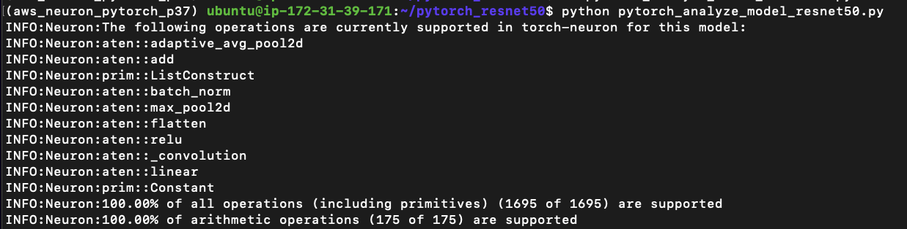
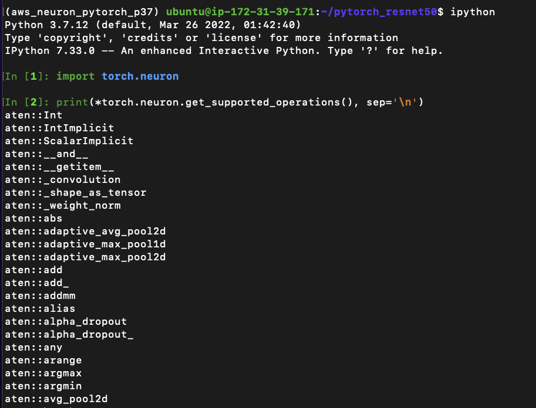
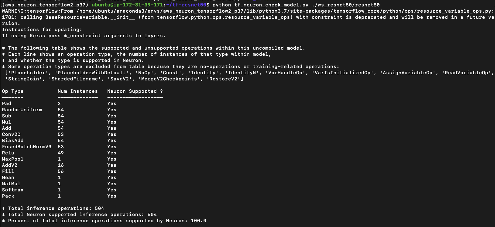
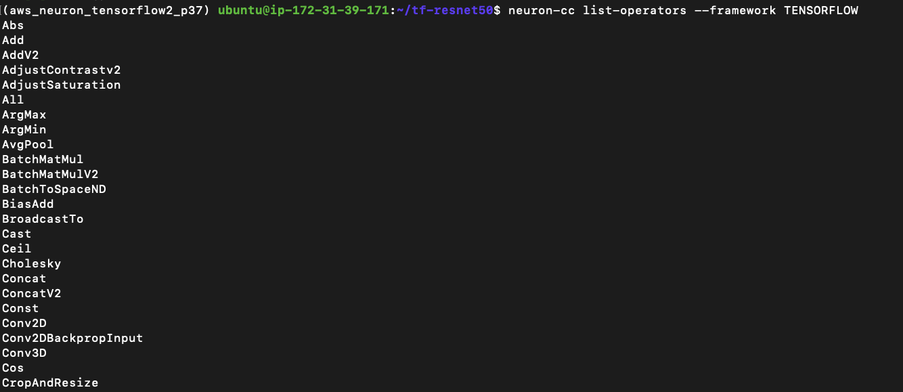

# Inferentia-Check Model  : Self-Study-On-SageMaker

**마지막 업데이트: 2022.07.23**


---
# 대상 모델이 Neuro SDK 로 컴파일 가능 여부 확인 하기

## 1. Pytorch
- 아래는 ResNet50 모델을 예시로 함.

### 1.1. torch.neuron.analyze_model() 체크하기

- (1) 아래 Link 로 먼저 PyTorch 로 ResNet-50 컴파일 해보기
    - Using PyTorch-Neuron and the AWS Neuron Compiler
        - https://docs.aws.amazon.com/dlami/latest/devguide/tutorial-inferentia-pytorch-neuron.html
- (2) 아래의 코드를 pytorch_analyze_model_resnet50.py 로 저장하기

```python
import torch
import numpy as np
import os
import torch_neuron
from torchvision import models

image = torch.zeros([1, 3, 224, 224], dtype=torch.float32)

## Load a pretrained ResNet50 model
model = models.resnet50(pretrained=True)

## Tell the model we are using it for evaluation (not training)
model.eval()
model_neuron = torch.neuron.analyze_model(model, example_inputs=[image]) 
```
- (3) 위의 코드를 아래와 같이 실행 하기

```bash
python pytorch_analyze_model_resnet50.py 
```
- (4) 아래와 같은 결과 확인
    - 

### 1.2. torch.neuron.get_supported_operations() 확인하기
- [PyTorch Supported operators](https://awsdocs-neuron.readthedocs-hosted.com/en/latest/release-notes/neuron-cc-ops/neuron-cc-ops-pytorch.html)
- 실행 예시
    - 
    
    
## 2. Tensorflow
- 아래는 ResNet50 모델을 예시로 함.

### 2.1. 제공하는 tf_neuron_check_model.py 로 모델 확인하기

- (1) 아래 Link 로 먼저 Tensorfolow 로 ResNet50 컴파일 해보기
    - Using TensorFlow-Neuron and the AWS Neuron Compiler
        - https://docs.aws.amazon.com/dlami/latest/devguide/tutorial-inferentia-tf-neuron.html
- (2) 아래의 코드를 tensorflow_compile_resnet50.py 로 저장하기
    - 위 링크의 컴파일 코드와 동일 함. 하지만 실행시에 아래와 같은 에러 발생
    ```
  File "tensorflow_compile_resnet50.py", line 27
     session = keras.backend.get_session(),
           ^
SyntaxError: invalid character in identifier
    ```
    
    
    - 아래의 코드를 사용 권장.    
```python

import os
import time
import shutil
import tensorflow as tf
import tensorflow.neuron as tfn
import tensorflow.compat.v1.keras as keras
from tensorflow.keras.applications.resnet50 import ResNet50
from tensorflow.keras.applications.resnet50 import preprocess_input

# Create a workspace
WORKSPACE = './ws_resnet50'
os.makedirs(WORKSPACE, exist_ok=True)

# Prepare export directory (old one removed)
model_dir = os.path.join(WORKSPACE, 'resnet50')
compiled_model_dir = os.path.join(WORKSPACE, 'resnet50_neuron')
shutil.rmtree(model_dir, ignore_errors=True)
shutil.rmtree(compiled_model_dir, ignore_errors=True)

# Instantiate Keras ResNet50 model
keras.backend.set_learning_phase(0)
model = ResNet50(weights='imagenet')

# Export SavedModel
tf.saved_model.simple_save( 
    session = keras.backend.get_session(),
    export_dir = model_dir,
    inputs = {'input': model.inputs[0]},
    outputs= {'output': model.outputs[0]})

# Compile using Neuron
tfn.saved_model.compile(model_dir, compiled_model_dir)

# Prepare SavedModel for uploading to Inf1 instance
shutil.make_archive(compiled_model_dir, 'zip', WORKSPACE, 'resnet50_neuron')
```

- (3) 위의 코드를 아래와 같이 실행하여 모델 생성하고 컴파일 하기

```bash
python tensorflow_compile_resnet50.py 
```
- (4) 아래와 같은 이미 제공되고 있는 tf_neuron_check_model.py 다운로드

```bash
pip install tensorflow_hub
wget https://raw.githubusercontent.com/aws/aws-neuron-sdk/master/src/neuron-gatherinfo/tf_neuron_check_model.py
python tf_neuron_check_model.py -h

```

- (5) 아래와 같이 tf_neuron_check_model.py 실행 하기
    - ./ws_resnet50/resnet50 는 (4) 과정을 통해서 모델 생성이 된 경로 임.
    
```bash
python tf_neuron_check_model.py ./ws_resnet50/resnet50

```

- (6) 결과 확인 하기
    - 


### 2.2. Neuron Supported operators (tensorlow 포함)
- [Neuron Supported operators](https://awsdocs-neuron.readthedocs-hosted.com/en/latest/release-notes/neuron-cc-ops/index.html?highlight=Tensorflow%20Supported%20operators)
- Tensorflow 예시
- 
    