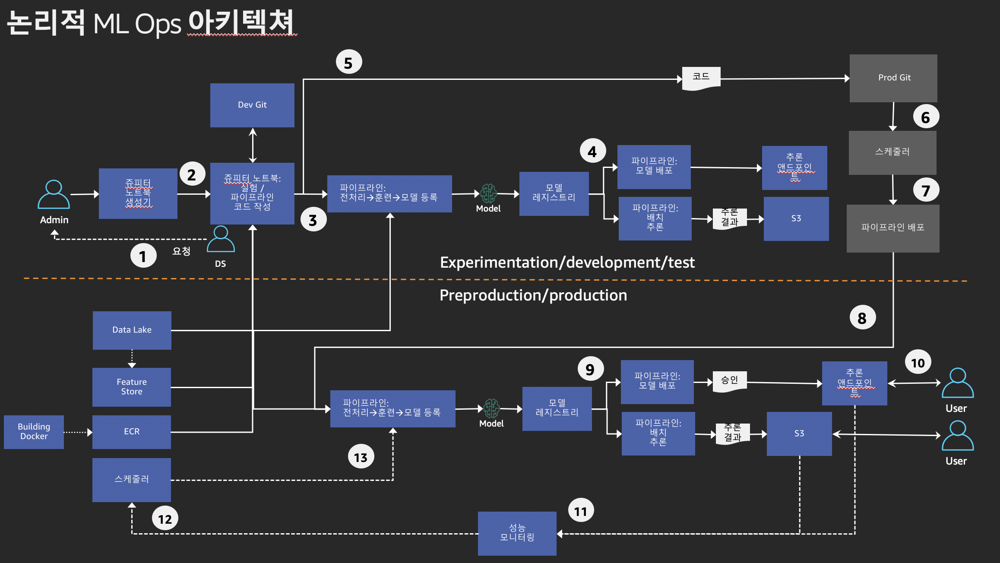
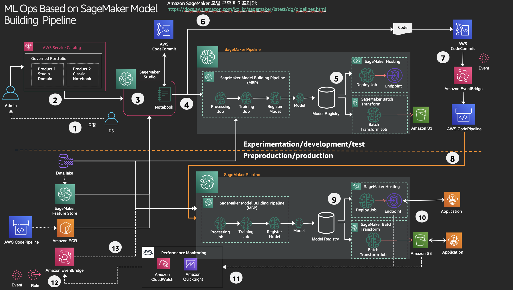

# ML OPs on SageMaker Step by Step

### 1.1 SageMaker Model Building Pipeline 으로 개발/프로덕션 분리 유스 케이스: 

**마지막 업데이트: 2022.03.24**

---

 아래는 ML Ops를 구성할때의 개발 및 프러뎍션을 구분해서 논리적 구성도를 작성 하엿습니다. 이러한 논리적 구성도는 여러 ML Ops 로 표현이 가능합니다. 아래 그림의 번호 (에: (1), (2) .... , (13)) 을 화살표로 따라 가면서 보시면 됩니다. 

---

---

아래는 SageMaker Model Building Pipeline 기반으로 물리적 구현을 할 수 있는 내용을 보여 드립니다. 이러한 물리적 구현은 어떠한 다른 솔류션 혹은 기술 여력이 없으면 일부는 사람이 직접 할 수도 있습니다.

---

조금 더 상세한 자료는 아래 PDF 파일을 참조 하세요. 위의 물리적 구현에 대한 기술 구현 관련 내용도 제공 하고 있습니다.

- [220323-MLOps-UseCase-SM-MBP.pdf](220323-MLOps-UseCase-SM-MBP.pdf)