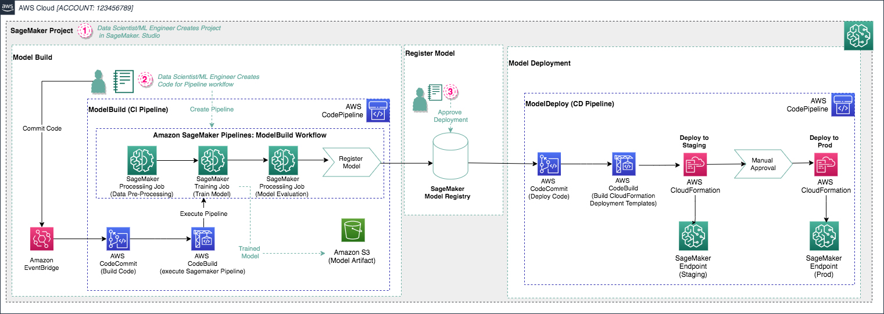

# ML OPs Step by Step

**마지막 업데이트: 2022.01.18**

---

[블로그, 초급, Jan 2019] [Building, automating, managing, and scaling ML workflows using Amazon SageMaker Pipelines](https://aws.amazon.com/blogs/machine-learning/building-automating-managing-and-scaling-ml-workflows-using-amazon-sagemaker-pipelines/)
   
- 요약
    - SageMaker Pipeline Project 를 처음 시작하는  Getting Started 블로그 입니다.
    - 기본 내장 템블릿 "MLOps template for model building, training, and deployment" 을 SageMaker Studio GUI 환경에서 코드 없이 클릭, 클릭으로 실습 해보는 내용 입니다.
    - [강추] 위 블로그의 한글 버전의 실습을 아래에서 할 수 있습니다. 한글로 친절하게 단계별로 되어 있어서 따라 하기 좋습니다.
        - [SageMaker Pipeline 내장 프로젝트 실습](https://github.com/comeddy/amazon-sagemaker-mlops/blob/main/SUMMARY.md) 
- 구현 내용    
    -     
