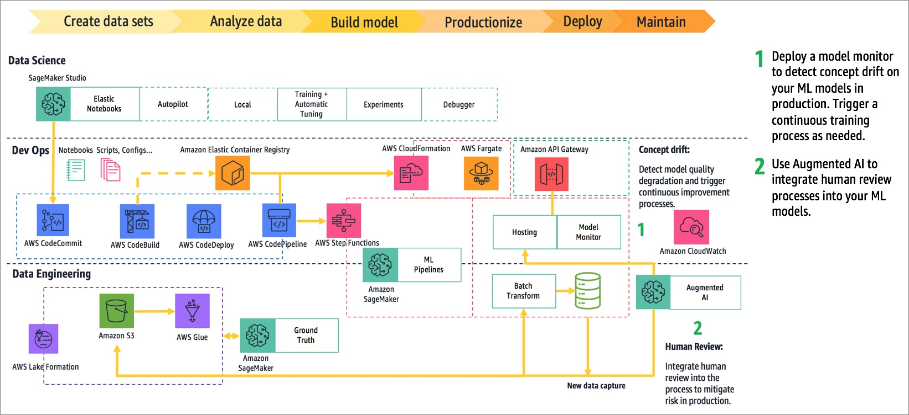
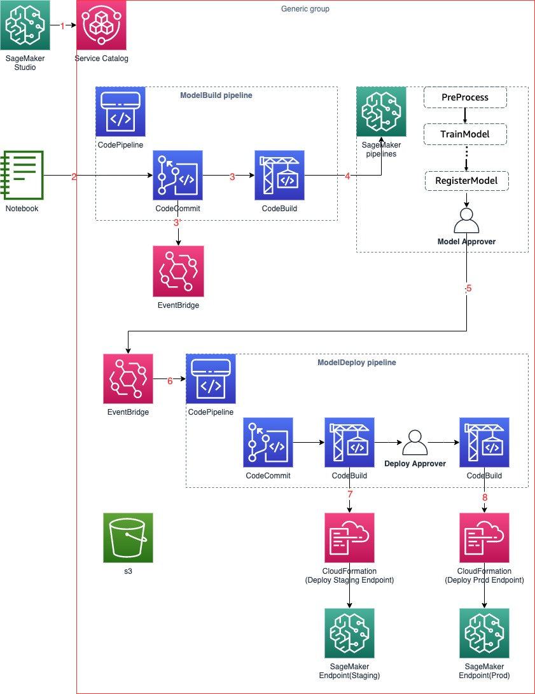
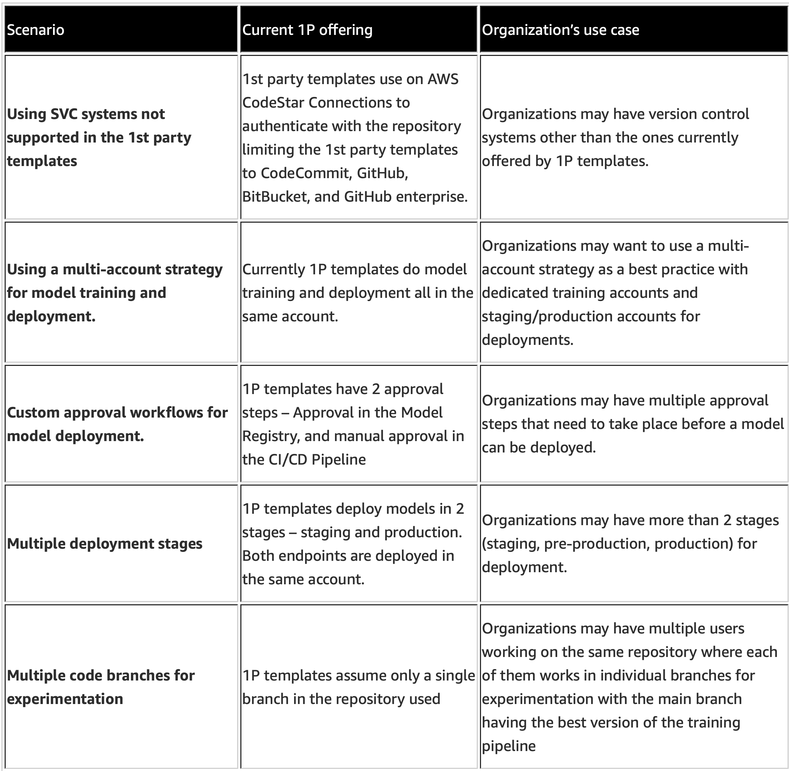
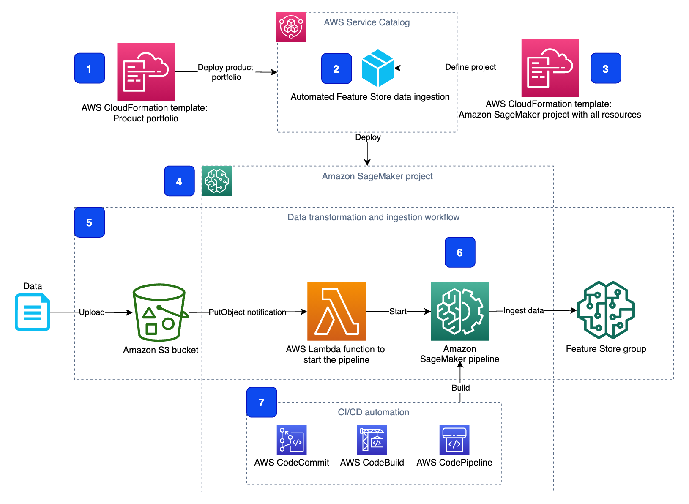
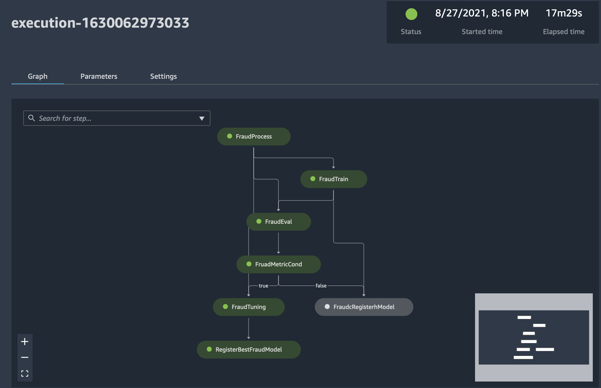
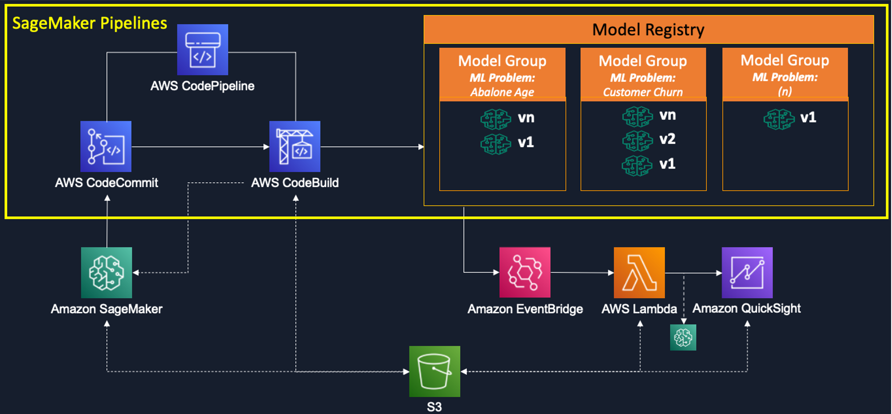
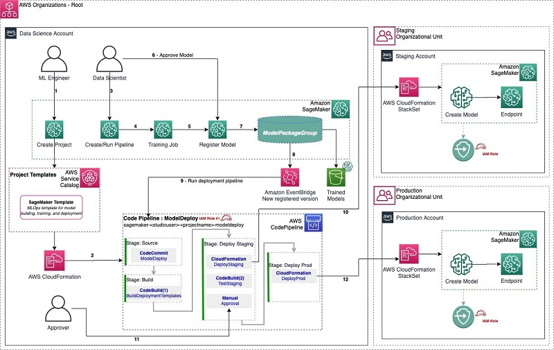
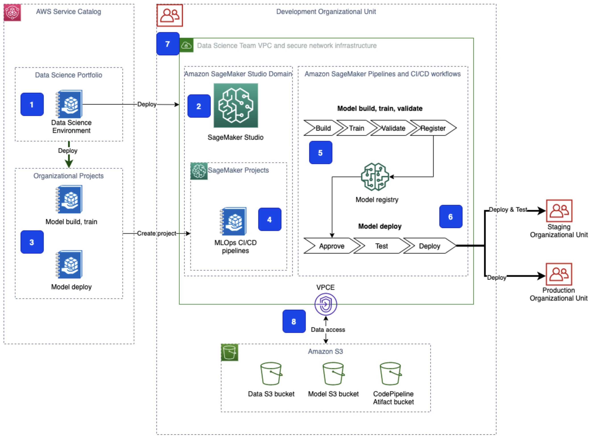

# ML OPs on SageMaker Step by Step

**마지막 업데이트: 2022.01.19**

---
# 0. 가이드
- 실습 위주의 컨텐츠로 구성을 하였습니다. 
- 또한 순서도 쉬운 것 부터 어려운 것으로 구성을 하였기에, 단계별로 접근하시면 좋습니다.
---

# 1. 초급, 중급
### 1.1 [블로그, Apr 2020] How Slalom and WordStream Used MLOps to Unify Machine Learning and DevOps on AWS
- 개념적으로, 아키텍쳐 관점에서 모범이 되는 사례이기에 가장 처음 소개 합니다. 코드가 없고 사례를 설명을 하는 블로그 입니다.
- https://aws.amazon.com/blogs/apn/how-slalom-and-wordstream-used-mlops-to-unify-machine-learning-and-devops-on-aws/
   
   
- 요약
    - WordStream 회사가 AWS Service, Step Function, SageMaker 로 구성한 사례 임.
    - ML Ops 를 단계별로 접근하여 완성하는 모범적인 사례 임.
    - 전체 아키텍쳐의 구성을 위해서 아래 단계를 순서로 구현 함.
        - (1) Establish a data architecture
        - (2) Facilitate data analysis
        - (3) Enable rapid prototyping
        - (4) Productionize pipelines
        - (5) Deploy ML models
        - (6) Continuous improvement
- 구현 내용    
    -     
- 코드
    - 공개 되지 않음.

### 1.2 [워크샵, Apr 2021] Amazon SageMaker Pipelines Getting Started
- https://github.com/comeddy/amazon-sagemaker-mlops
- 요약
    - SageMaker Pipeline Project 의 내장 템플릿을 사용하여 SageMaker Studio GUI 환경에서 코드 없이 클릭, 클릭으로 실습 해보는 내용 입니다. 처음 시작하는 입문용 입니다.  
    - 기본 내장 템블릿 "MLOps template for model building, training, and deployment" 을 구현 합니다.
    - 공식 개발자 가이드를 기본으 함. [SageMaker MLOps Project Walkthrough](https://docs.aws.amazon.com/sagemaker/latest/dg/sagemaker-projects-walkthrough.html)
- 구현 내용    
    -     
- 코드
    - 실습 시간: 약 40 분
    - 위의 제목 링크

### 1.3 [블로그, Jan 2021] Building, automating, managing, and scaling ML workflows using Amazon SageMaker Pipelines
- https://aws.amazon.com/blogs/machine-learning/building-automating-managing-and-scaling-ml-workflows-using-amazon-sagemaker-pipelines
- 요약
    - SageMaker Pipeline Project의 기본 내장 템블릿 "MLOps template for model building, training, and deployment" 을 기반으로 사용자의 코드를 넣어서 만들어 보는 예시 입니다. 
- 구현 내용    
    -     
- 코드
    - 실습 시간: 약 1시간 
    - 블로그의 가이드 참조

### 1.4 [블로그, Oct 2021] Build Custom SageMaker Project Templates – Best Practices
- https://aws.amazon.com/blogs/machine-learning/build-custom-sagemaker-project-templates-best-practices
- 요약
    - SageMaker Pipeline Project의 기본 내장 템블릿 의 작동 원리를 설명하고, 커스텀 템플릿으로 확장하는 방법에 대한 베스트 프렉티스를 설명 함.
- 주요 내용    
    -     
- 코드
    - 실습 시간: TBD
    - https://github.com/aws-samples/sagemaker-custom-project-templates

### 1.5 [블로그, Oct 2021] Enhance your machine learning development by using a modular architecture with Amazon SageMaker projects
- https://aws.amazon.com/blogs/machine-learning/enhance-your-machine-learning-development-by-using-a-modular-architecture-with-amazon-sagemaker-projects/
- 요약
    - Service Catalgo Product 의 생성을 통하여 SageMaker Pipeline 커스텀 템플릿을 생성하는 방법을 실습 합니다. 
    - S3 에 파일이 업로드되면, 세이지 메이커 파이프라인이 실행되어서 데이터 전처리 후에 피쳐 스토어에 저장하는 워크프로우가 구현 됩니다.
- 주요 내용    
    -     
- 코드
    - 실습 시간: TBD
    - https://github.com/aws-samples/amazon-sagemaker-reusable-components

### 1.6 [워크샵, Aug 2021] SageMaker-Pipelines-Step-By-Step 워크샵
- https://github.com/gonsoomoon-ml/SageMaker-Pipelines-Step-By-Step
- 요약
    - SageMake Model Building Pipeline 을 단계 별로 실습할 수 있습니다. 크게 아래 3가지 Phase 가 있습니다.
        - (1) Scratch
            - 가장 기본적인 파이프라인을 구현을 합니다. 파이프라인 스텝의 단계 하나, 하나를 구현하면서 이후에 합쳐서 파이프라인 구성 합니다.
        - (2) Phase1
            - 조금더 "스텝" 을 더 이용한 파이프라인을 생성 합니다. 예를 들어서 튜닝 스텝, 모델 레지스트리 스텝, 모델 평가 스템, 조건 스텝 및 캐싱 기능 사용합니다.
        - (3) Phase2 에서는 아래 두가지 파이프 라인을 생성 합니다.
            - (a) 모델 빌딩 파이프라인을 생성
            - (b) 모델 배포 파이프라인을 생성
- 구현 내용    
    -     
- 코드
    - 실습 시간: 4시간
    - 위의 링크 임.

### 1.7 [워크샵, Oct 2021] Amazon SageMaker를 이용한 시계열 학습과 MLOps 구성
- https://github.com/Napkin-DL/sm-informer-mlops-quicksight
- 요약
    - SageMaker에서 Time series 모델을 학습하는 방법과 함께 SageMaker Pipelines을 이용하여 간단한 MLOps를 구성하는 실습 과정입니다. 
- 구현 내용    
    -     
- 코드
    - 실습 시간: TBD
    - 위의 링크 임.

# 2. 고급

### 2.1 [블로그, Jan 2021] Multi-account model deployment with Amazon SageMaker Pipelines
- https://aws.amazon.com/blogs/machine-learning/multi-account-model-deployment-with-amazon-sagemaker-pipelines/
- 요약
    - Data Science, Staging, Production 계정 3개로 멀티 계정을 사용함.
    - SageMaker Pipeline 커스텀 템플릿을 생성하여 구현을 함.
- 주요 내용    
    -     
- 코드
    - 실습 시간: TBD
    - 블로그의 내용을 따라 함.
    
### 2.2 [블로그, Aug 2021] Secure multi-account model deployment with Amazon SageMaker: Part 1, Part2
- Part1
    - https://aws.amazon.com/blogs/machine-learning/part-1-secure-multi-account-model-deployment-with-amazon-sagemaker/
- Part2
    - https://aws.amazon.com/blogs/machine-learning/part-2-secure-multi-account-model-deployment-with-amazon-sagemaker/
- 요약
    - 아래와 같은 구성 요소를 하나씩 설명하고 구현을 함.
    - AWS Service Catalog
    - SageMaker Studio Domain
    - SageMaker MLOps project templates
    - CI/CD workflows
    - Secure infrastructure
    - Data security
    - Multi-account structure
    - SageMaker Pipeline 커스텀 템플릿을 생성하여 구현을 함.
- 주요 내용    
    -     
- 코드
    - 실습 시간: TBD
    - https://github.com/aws-samples/amazon-sagemaker-secure-mlops
- 참고
    * Build a Secure Enterprise Machine Learning Platform on AWS
    * 화이트 백서 입니다.
        * https://docs.aws.amazon.com/ko_kr/whitepapers/latest/build-secure-enterprise-ml-platform/build-secure-enterprise-ml-platform.html

    

    

