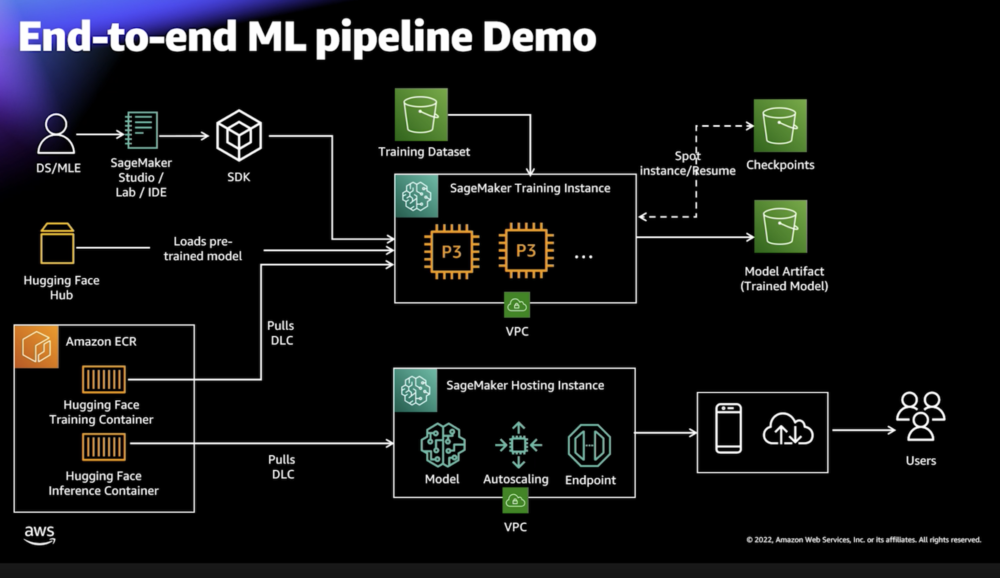

# NLP 주요 참고 문서

**마지막 업데이트: 2022.01.19**

---

# 1. 초급, 중급
### 1.1 [블로그, Jan 2022] Amazon Comprehend 기반 설공 상품평 분석을 통한 상품 트렌드 예측도 개선하기
- https://aws.amazon.com/ko/blogs/korea/amazon-comprehend-goods-trend-prediction/
      
- 요약
    - 고객의 리뷰의 감정 분석을 Amazon Comprehend, KoBERT 를 통하여 분류한 고객의 직접 사례 입니다.
- 구현 내용    
    -     
- 코드
    - 공개 되지 않음.

### 1.2 [워크샵, Feb 2022] 모두를 위한 클라우드 네이티브 한국어 자연어 처리 모델 훈련 및 활용법 (부제: 허깅페이스(Hugging Face)와 Amazon SageMaker가 만났다!)
- https://github.com/daekeun-ml/sm-huggingface-kornlp
      
- 요약
    - 한국어 네이버 영화 리뷰 데이터를 이용하여 감성 분석을 함.
    - HuggingFace NLP 모델을 SageMaker 에서 Fine-Training 및 이미 훈련된 모델을 가져와서 배포 및 추론을 하는 코드 임.
    - "(1) 훈련 실습, (2) 추론 실습, (3) SageMaker MLOps Pipeline 구현" 을 통하여 3개의 단계를 각각 실습 할 수 있음.
- 구현 내용    
    - 아래의 이미지는 2022 AWS Innovation 의 김대근님 발표 영상에서 가져 왔습니다.
    -     
- 코드
    - 위의 코드 리파지토리

