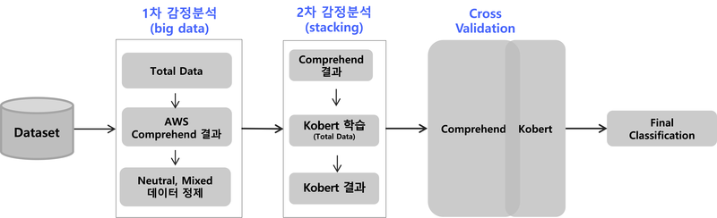

# NLP 주요 참고 문서

**마지막 업데이트: 2022.01.19**

---

# 1. 초급, 중급
### 1.1 [블로그, Jan 2022] Amazon Comprehend 기반 설공 상품평 분석을 통한 상품 트렌드 예측도 개선하기
- https://aws.amazon.com/ko/blogs/korea/amazon-comprehend-goods-trend-prediction/
      
- 요약
    - 고객의 리뷰의 감정 분석을 Amazon Comprehend, KoBERT 를 통하여 분류한 고객의 직접 사례 입니다.
- 구현 내용    
    -     
- 코드
    - 공개 되지 않음.

