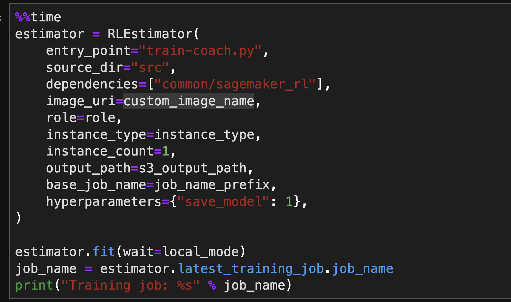
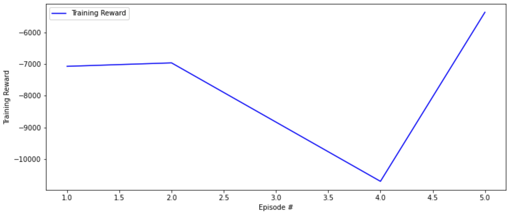
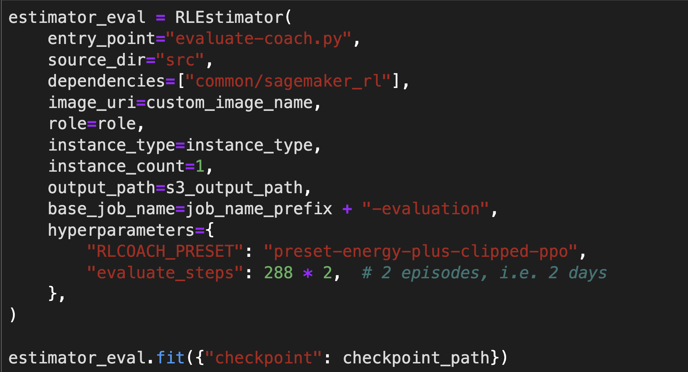
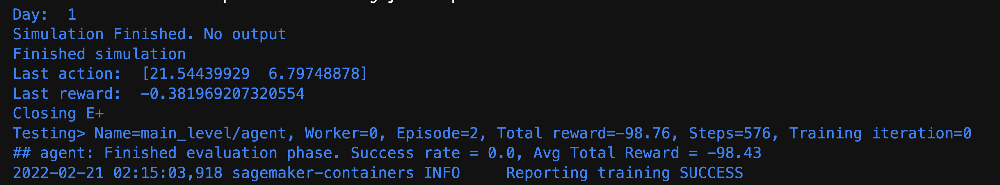

# SageMaker-RL Example: rl_hvac_coach_energyplus
---

**마지막 업데이트: 2022.02.20**

# 1. rl_hvac_coach_energyplus

- Code: HVAC with Amazon SageMaker RL
    - https://github.com/aws/amazon-sagemaker-examples/tree/main/reinforcement_learning/rl_hvac_coach_energyplus
    
## 1.1. 문제 정의:
- 목표:
    - 데이터 센터 HVAC 시스템을 제어하여 에너지 소비를 줄이는 동시에 실내 온도가 지정된 한계 내로 유지되도록 합니다.
- 환경: 
    - 컴퓨팅 장비가 제대로 작동하는지 확인하기 위해 HVAC 시스템이 냉각되는 소규모 싱글룸 데이터 센터가 있습니다. 우리는 샌프란시스코의 기상 조건에 따라 하루 동안 이 HVAC 시스템을 제어하도록 RL 에이전트를 훈련할 것입니다. 에이전트는 24시간 동안 5분마다 작업을 수행합니다. 따라서 에피소드는 고정 120 단계입니다.
- 상태: 
    - 실외 온도, 실외 습도 및 실내 실내 온도.
- 액션: 
    - 에이전트는 가열 및 냉각 설정값을 설정할 수 있습니다. 냉각 설정값은 실내 온도가 이 설정값을 초과하면 실내 냉각을 시작해야 한다고 HVAC 시스템에 알립니다. 마찬가지로 HVAC 시스템은 실내 온도가 난방 설정점 아래로 내려가면 난방을 시작합니다.
- 보상: 
    - 보상에는 계수와 함께 추가되는 두 가지 구성 요소가 있습니다. HVAC 시스템에서 소비하는 에너지에 비례합니다.실내 온도가 사전 지정된 하한 또는 상한(data_center_env.py에 정의됨)을 초과하면 큰 패널티를 받습니다.

## 1.2 솔류션 구성:

* Domain
    * HVAC (Heating, Ventilation, Air Conditioning)
* RL Env
    * Opensource - EnergyPlus
* RL Toolkit
    * RL-Coach
* DL 프레임워크: 
    * MXNet
    
## 1.3 SageMaker RL 사용한 구성요소
- 그림의 빨간색 사각형이 이 예제에서 사용한 구성 요소 입니다.

    
## 1.3 훈련 방식
* 훈련 다커 켄테이너 빌딩
    * RL Toolkit + RL Env
    * Docker file
    * 
* 세이지 메이커 스크립트 모드
    * 
    * 훈련 메트릭 (보상)
    * 
    
## 1.5 모델 평가
* 
* 평가 내용
    * 
    
## 1.6 모델 배포 및 추론
* 

