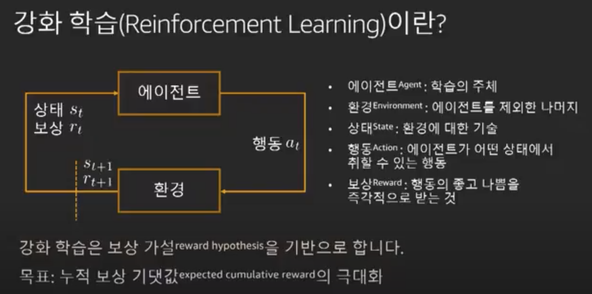
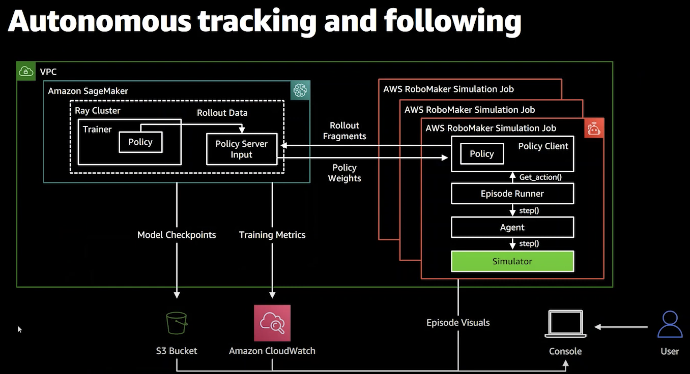

# SageMaker-RL (세이지 메이커 강화 학습)
---

**마지막 업데이트: 2022.09.13**

# 1. 유용한 세션

    
## 1.1 AWS Summit ANZ 2021 - Using reinforcement learning to solve business problems
- https://www.youtube.com/watch?v=ifIpqSmcnEE
- 
    
## 1.2 AWS로 강화학습 쉽게 시작하기 - 김대근, AWS 솔루션즈 아키텍트:: AWS Summit Online Korea 2020
- https://www.youtube.com/watch?v=eIz_rC7hEyE
- 

## 1.3 AWS re:Invent 2020: Reinforcement learning and robotics
- https://www.youtube.com/watch?v=awmMhZdS70s
- 
    

# 2. SageMaker RL Example 요약 
## 2.1 rl_hvac_coach_energyplus
- 데이터 센터 HVAC (히팅, 통풍, 쿨링) 제어 최적화
    - 상세 보기: [rl_hvac_coach_energyplus](Example/README-rl_hvac_coach_energyplus.md)
    
    
# 3. 관련 블로그
- [Underfloor Heating Optimisation using offline Reinforcement Learning (Sep 2022)](https://medium.com/@yapweiyih/underfloor-heating-optimisation-using-offline-reinforcement-learning-44f7747f4d6f)