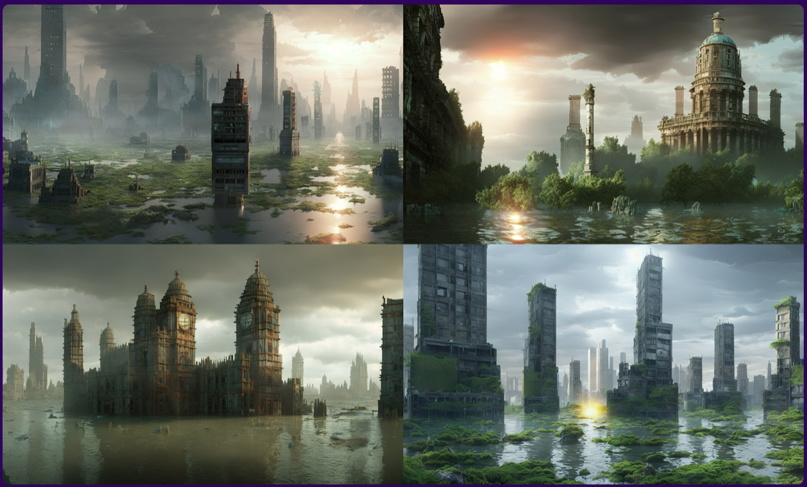
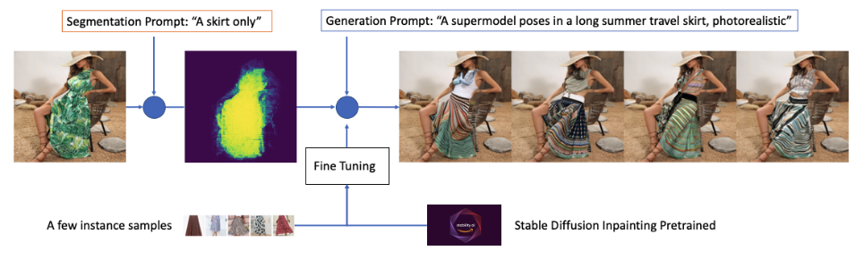
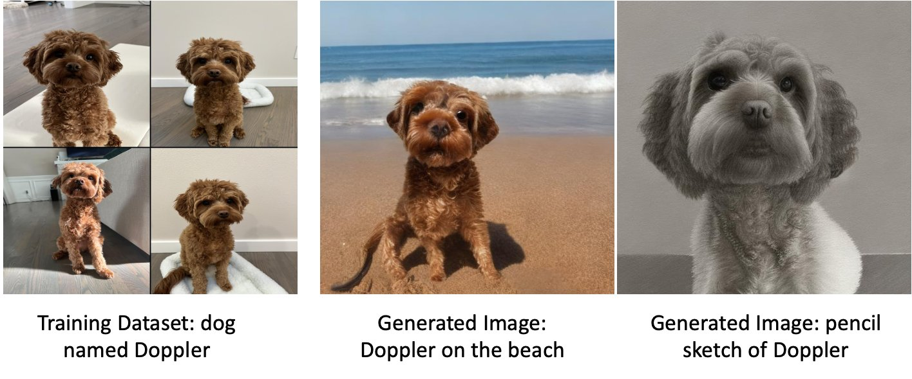
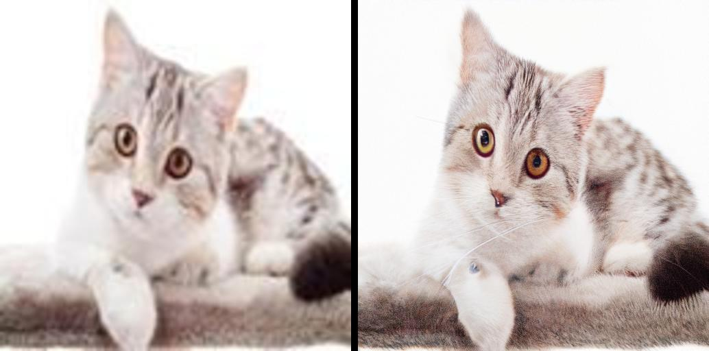
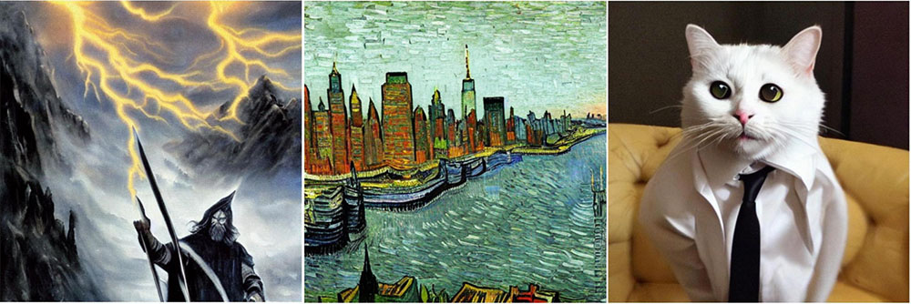
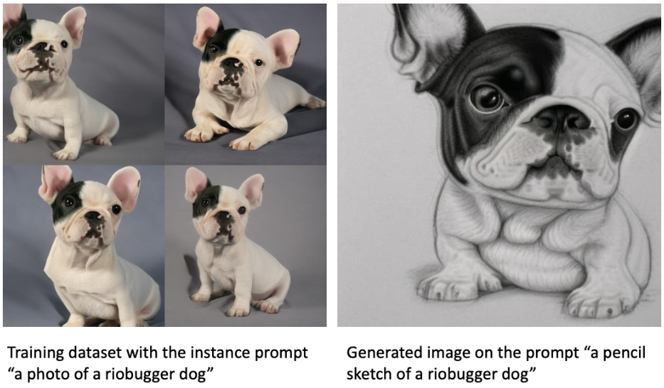
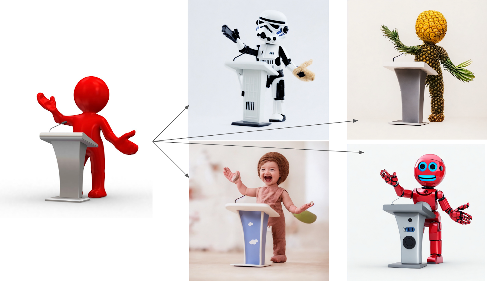

# SageMaker Stable Diffusion

**마지막 업데이트: 2023.03.03**

---
SageMaker Stable Diffusion 스스로 공부할 수 있는 링크 및 설명을 제공 합니다. 자세한 사항은 참조의 블로그 및 기타 링크를 확인 부탁 합니다.

---

# 1. Stable Diffusion Landscape
Generative AI 로서 Stable Diffusion 의 뉴스가 많이 나옵니다. 기사 및 블로그가 나오다 보니, Stable Diffusion 을 A to Z 까지 알고 싶을 수 있습니다. 아래 링크 클릭해서 확인 해보세요.
- Stable Diffusion Landscape
    - [Stable Diffusion Landscape and How it works](Stable-Diffusion.md)

# 2. 블로그
최신 블로그 순서로 정리되어 있습니다. 처음 접근하시는 분은 가장 아래에서 부터 보시면 좋습니다.

### [Mar 2023, Virtual fashion styling with generative AI using Amazon SageMaker ]
- 유저들이 모델 혹은 본인에게 여러가지의 옷을 바꾸어서 볼 수 있다면 좋지 않을까? 라는 문제로 접근합니다. 실제 아래의 이미지 처럼 원본의 이미지에서 "파인 튜닝된 Stable Diffusion" 모델로 추론시에 모델이 여러 가지의 옷을 바꾸어 입은 이미지를 생성 합니다. 작업 단계는 아래와 같습니다.
    - (1) CLIPSeq 사전 학습된 모델을 통해서, "A skirt only" 의 텍스트를 입력하여 "스커트" 의 segmentation 된 이미지를 생성 합니다. 
    - (2) Stable Diffusion Inpainting Pretrained 모델과 여성의 스커드 이미지 약 12장 이내와 이미지를 설명하는 "텍스트" 를 가지고 파인 튜닝 합니다. 이후에 SageMaker Endpoint 에 배포 합니다.
    - (3) SageMaker Endpoint 에 (1) 의 스커트 "segmentation" 이미지, 텍스트 "A female super-model poses in a casual long vacation skirt, with full body length, bright colors, photorealistic, high quality, highly detailed, elegant, sharp focus" 및 오리지널 이미지(생성이미지와 비교하기 위해 입력)  를 입력으로 하여 추론하면 아래처럼 모델이 여러 스커트를 입은 생성 이미지가 생성이 됩니다.
    - [Mar 2023, Virtual fashion styling with generative AI using Amazon SageMaker ](https://aws.amazon.com/blogs/machine-learning/virtual-fashion-styling-with-generative-ai-using-amazon-sagemaker/) 
    - 

### [Feb 2023, Fine-tune text-to-image Stable Diffusion models with Amazon SageMaker JumpStart]
- Stable Diffusion 을 통해서 파인 튜닝하는 방법에 대한 단계를 설명 합니다. 이를 SageMaker API 를 통해서 어떻게 하고, 또한 80개 정도의  오픈된 파인튜닝 모델도 소개 합니다.
    - [Feb 2023, Fine-tune text-to-image Stable Diffusion models with Amazon SageMaker JumpStart](https://aws.amazon.com/blogs/machine-learning/upscale-images-with-stable-diffusion-in-amazon-sagemaker-jumpstart/)    
    - 

### [Jan 2023, Upscale images with Stable Diffusion in Amazon SageMaker JumpStart]
- SageMaker Jumpstart 를 사용하여 미리 훈련된 "model-upscaling-stabilityai-stable-diffusion-x4-upscaler-fp16" 를 배포하여, 기존의 이미지를 추론하여 해상도를 높이는 방법을 설명 합니다.
    - [Jan 2023, Upscale images with Stable Diffusion in Amazon SageMaker JumpStart](https://aws.amazon.com/blogs/machine-learning/fine-tune-text-to-image-stable-diffusion-models-with-amazon-sagemaker-jumpstart/)    
    - 

### [Nov 2022, Generate images from text with the stable diffusion model on Amazon SageMaker JumpStart]
- SageMaker Jumpstart 및 SDK 를 사용하여,Stable Diffusion 2.1 을 모델 배포하고 추론을 합니다. 또한 Transfer Learning 의 Fine-Tuning 을 통하여 스타일을 학습하고 추론을 제공합니다.     - [Nov 2022, Generate images from text with the stable diffusion model on Amazon SageMaker JumpStart](https://aws.amazon.com/blogs/machine-learning/generate-images-from-text-with-the-stable-diffusion-model-on-amazon-sagemaker-jumpstart/)
    - 
    - 

### [Nov 2022, Stability AI builds foundation models on Amazon SageMaker]
- Stable Diffusion 2.0 이 SageMaker Jumpstart 에서 사용이 가능하다는 블로그 입니다. 
    - [Nov 2022, Stability AI builds foundation models on Amazon SageMaker](https://aws.amazon.com/blogs/machine-learning/stability-ai-builds-foundation-models-on-amazon-sagemaker/)
    - 