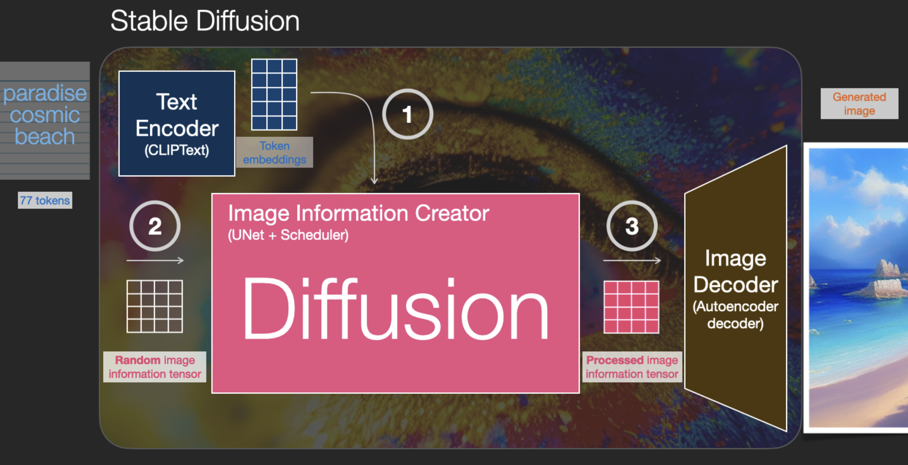
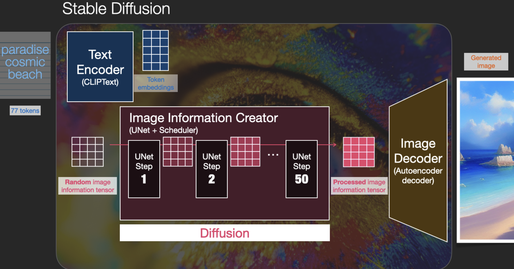
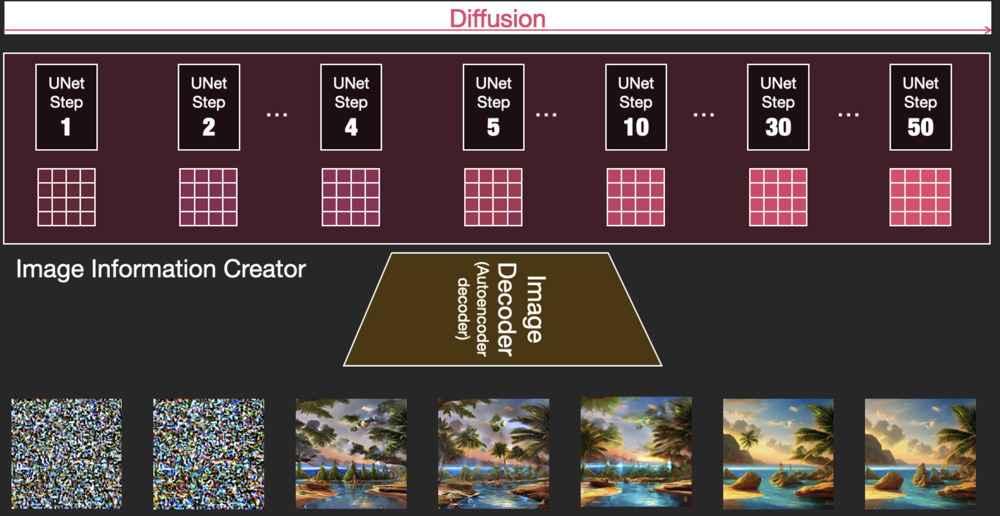
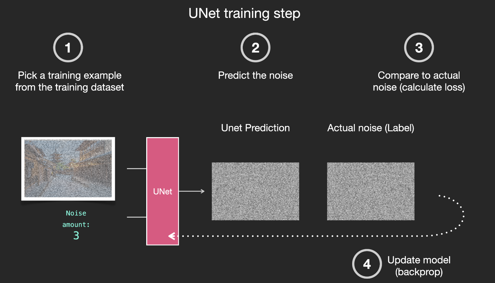
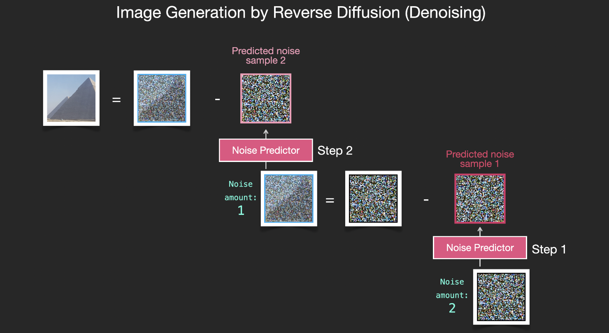
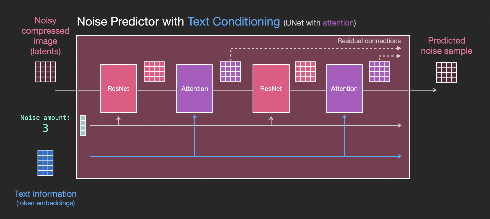
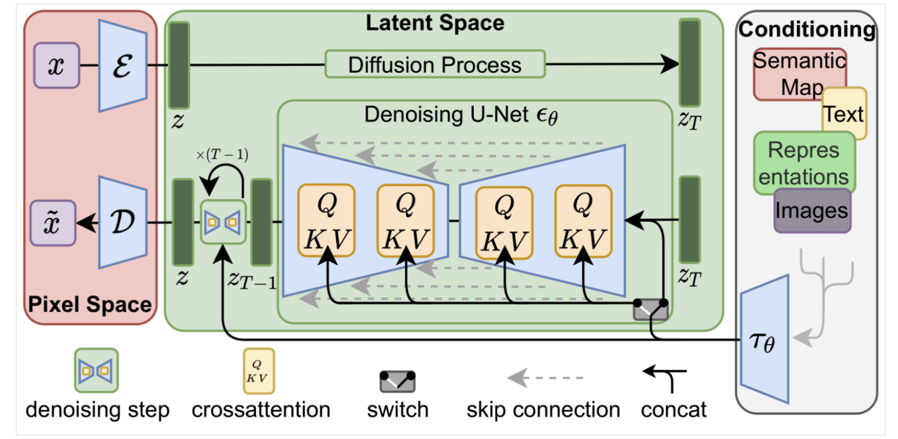

# How Stable Diffusion works

**마지막 업데이트: 2023.03.03**

---
    
    
# 1. Stable Diffusion 의 작동 방법 알아 보기

여러 블로그, 튜토리얼, 논문 같은 자료를 통해서 알 수 있습니다. 하나의 방법으로서 권장 드리고 싶은 것은 Jay Alammar 의 [The Illustrated Stable Diffusion](https://jalammar.github.io/illustrated-stable-diffusion/) 을 권장 드립니다. 또한 이 버전의 유투브 영상인 [AI Art Explained: How AI Generates Images (Stable Diffusion, Midjourney, and DALLE)](https://www.youtube.com/watch?v=MXmacOUJUaw) 권장 드립니다. 아래는 이 블로그의 핵심 내용 및 그림을 간단히 언급 드리겠습니다.

(1) "paradise cosmic beach" 라는 텍스트를 제공하면 Text Encoder 가 토큰 임베딩 값(텍스트값을 표현 하는 실수들의 값들)으로 변환하여 Image Information Creator (Diffusion) 블럭의 입력으로 제공 됩니다. (2) 두번째로 렌던 이미지 배열 값이 입력이 됩니다. (3) 세번째로 Diffusion 과정을 거친 후에 변형된 이미지 배열 값을 얻게 되고, (4) Image Decoder 를 통해서 최종 생성된 이미지를 보시게 됩니다.

Diffusion은 여러 단계로 이루어지며, 각 단계는 (1) "입력 텍스트" 및 모델이 훈련에서 얻은 (2) "이미지 정보"와 유사하게 동작하기 위해서 "입력 잠재 배열 (input latents array)" 을 매 스텝마다 생성하여 최종 "처리된 이미지 배열 값" 을 제공하고, 이는 Image Decoder 에 전달 합니다.

아래는 각 "입력 잠재 배열" 의 값을 시각화하여, 각 단계 마다 이미지가 "입력 텍스트" 에 맞게 변형 되는 것을 볼 수 있습니다.

(1) 훈련 데이터 세트에서 훈련 샘플을 선택 합니다. 예를 들어서 노이즈 양이 3 정도 인것을 예시로 합니다. UNet 모델을 통과 시키면 "예측된 노이즈"를 얻을 수 있습니다. 이를 실제 레이블인 "실제 노이즈" 와 함꼐 Loss 함수에 제공하여 Loss 를 얻은 후에 역전파를 통하여 UNet 의 모델 파라미터를 업데이트 하면서 훈련 하게 됩니다.

(1) 샘플된 노이즈를 Noise Predictor(Unet) 에 입력하면, "예측된 노이즈 샘플" 결과로 나옵니다. (2) 모델이 훈련을 통해 배웠던 이미지 정보에서 가장 근사한 이미지를 추출 합니다 ("근사 추출 이미지") (3) "근사 추출 이미지" 에서 "예측된 노이즈 샘플" 을 빼면, Diffusion 첫번재 단계가 완료 되고, 이후에 두번째 단계를 합니다. 이런식으로 마지막 단계까지 합니다. 

[중요] 
**훈련 데이터 세트가 미학적으로 만족스러운 이미지(예: Stable Diffusion이 훈련된 [LAION Aesthetics](https://laion.ai/blog/laion-aesthetics/))인 경우 결과 이미지는 미학적으로 만족스러운 경향이 있습니다. 로고 이미지로 훈련하면 로고 생성 모델이 됩니다.**

Text Conditioning 은 우리가 입력한 텍스트로 Diffusion 이 "가이드" 되면서 이에 가까운 이미지가 생성이 됩니다 Diffusion (UNet) 의 각 단계마다 Attention (Cross Attention)이 ResNet 블럭의 다음 단계마다 들어가게 되어서, 이를 통해서 각 단계는 "가이드" 되어서 텍스트와 유사한 이미지가 생성이 됩니다.

아래는 [High-Resolution Image Synthesis with Latent Diffusion Models](https://ommer-lab.com/research/latent-diffusion-models/) 논문에 있는 아티텍처 입니다. 위의 내용을 도식화한 그림 입니다. 

