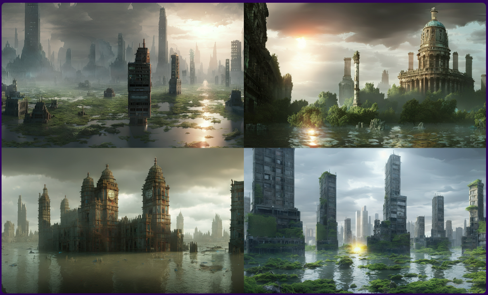

# Stable Diffusion Landscape

**마지막 업데이트: 2023.02.19**

---

# 1. Stability.ai 공식 웹사이트 방문

Generative AI 로서 Stable Diffusion 의 뉴스가 많이 나옵니다. 사실 이 영역이 처음인 분은 먼저 [Stability.ai official web site](https://stability.ai/) 를 방문하세요. Stability.ai 회사의 최신 서비스 발표등이 있습니다. 오늘 (2023.02.19) 현재 Stable Diffusion v2.1 내용이 인상적 입니다. 아래 이 버전으로 만든 이미지를 한번 보세요.

# 2. Stability.ai 공식 Git 방문

Stability.ai 에서 공식적으로 관리하는 GitHup 을 보시면, 최근 버전 및 과거 버전이 어떤 기능이 제공이 되고, 어떻게 변경이 되었는지 알 수 있습니다. 

Stability.ai official GitHub
* https://github.com/Stability-AI/stablediffusion
* Version 2.1 : December 7. 2022 
    * same number of parameters and architecture as 2.0 and fine-tuned on 2.0, on a less restrictive NSFW filtering of the LAION-5B
* Version 2.0 : Nov 24, 2022
    * U-Net as 1.5 but uses OpenCLIP-ViT/H as the text encoder
    * Added a x4 upscaling latent text-guided diffusion model
    * depth-guided stable diffusion model
    * structure-preserving img2img and shape-conditional synthesis
    * A text-guided inpainting model
    * Evaluations with different classifier-free guidance scales (1.5, 2.0, 3.0, 4.0, 5.0, 6.0, 7.0, 8.0) and 50 DDIM sampling steps
* Stability.ai 와 Hugging Face 가 파트너십을 맺고, 최신 모델들이 공개 및 관련 튜토리얼이 많습니다. 참고로 아래는 Stable Diffusion v2.1 모델 정보 입니다.
    - https://huggingface.co/stabilityai/stable-diffusion-2-1
    
    
