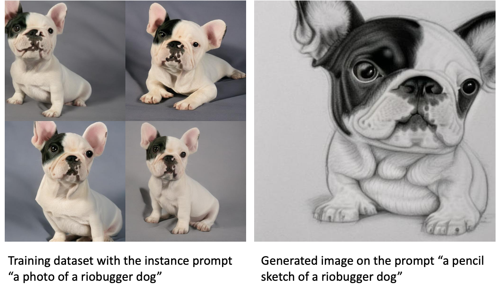

# SageMaker Text-To-Image

**마지막 업데이트: 2023.02.12**

---
SageMaker Text-To-Image 스스로 공부할 수 있는 링크 및 설명을 제공 합니다. 자세한 사항은 참조의 블로그 및 기타 링크를 확인 부탁 합니다.

---

# 1. 블로그
최신 블로그 순서로 정리되어 있습니다. 처음 접근하시는 분은 가장 아래에서 부터 보시면 좋습니다.

- SageMaker Jumpstart 를 사용하여 미리 훈련된 "model-upscaling-stabilityai-stable-diffusion-x4-upscaler-fp16" 를 배포하여, 기존의 이미지를 추론하여 해상도를 높이는 방법을 설명 합니다.
    - [Jan 2023, Upscale images with Stable Diffusion in Amazon SageMaker JumpStart](https://aws.amazon.com/blogs/machine-learning/upscale-images-with-stable-diffusion-in-amazon-sagemaker-jumpstart/)    
- SageMaker Jumpstart 및 SDK 를 사용하여,Stable Diffusion 2.1 을 모델 배포하고 추론을 합니다. 또한 Transfer Learning 의 Fine-Tuning 을 통하여 스타일을 학습하고 추론을 제공합니다. 
    - [Nov 2022, Generate images from text with the stable diffusion model on Amazon SageMaker JumpStart](https://aws.amazon.com/blogs/machine-learning/generate-images-from-text-with-the-stable-diffusion-model-on-amazon-sagemaker-jumpstart/)
    - 
- Stable Diffusion 2.0 이 SageMaker Jumpstart 에서 사용이 가능하다는 블로그 입니다. 
    - [Nov 2022, Stability AI builds foundation models on Amazon SageMaker](https://aws.amazon.com/blogs/machine-learning/stability-ai-builds-foundation-models-on-amazon-sagemaker/)