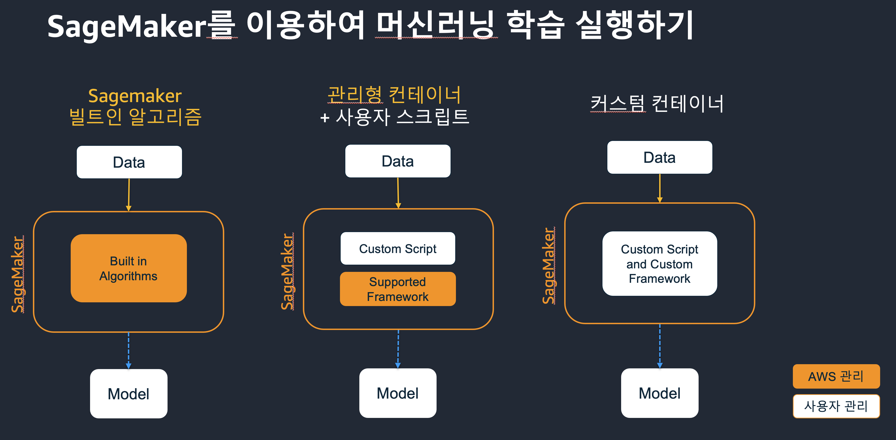
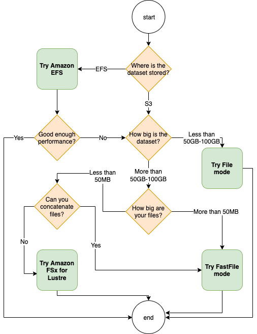

# Training : Self-Study-On-SageMaker

**마지막 업데이트: 2022.03.08**

---

# 1. 세이지 메이커의 훈련 개요

# 2. 세이지 메이커의 스크립트 모드 (Bring Your Own Script, BYOS)
- TBD
- 로컬 모드 사용시에 다커의 위치 변경 및 Shared Memory 사이즈 변경
    - [로컬 모드 셋업 가이드](../workaround/sagemaker_classic_nb_localmode-shm_error.md)

# 3. 세이지 메이커의 사용자 정의 컨테이너 (Bring Your Own Container, BYOC)

## 3.1 처음 시작하기
- 세이지메이커에서 도커 컨테이너 사용
    - [공식 기발자 가이드](https://docs.aws.amazon.com/ko_kr/sagemaker/latest/dg/docker-containers.html)
* 기본 BYOC 작성 코드 예시
    * https://github.com/aws-samples/aws-ai-ml-workshop-kr/tree/master/sagemaker/byoc

## 3.2 BYOC 실무 적용하기

* BYOC를 만드는 방법이 크게 4가지가 있습니다. (Basic, Script Mode1, 2 , Framework)
    * Basic 으로 컨테이너를 생성하면, 훈련 코드(예: train.py) 가 컨테이너에 같이 포함되어서 생성이 되기에, 매번 수정이 되면 다커를 다시 빌딩하고 ECR에 등록해야 하는 과정을 거칩니다.
    * *Script Mode, Framework 방식을 사용하면 훈련 코드를 정적으로 다커에 포함하지 않고, 훈련시만 지정해서 사용 가능 합니다. 매번 다커 빌딩 및 ECR 푸시할 필요가 없습니다. 이것 테스트 해보시면 좋겠습니다. *
        * Framework 혹은 Script Mode2 추천
    * Amazon SageMaker Custom Training containers 만드는 4가지 방식
        * https://github.com/aws/amazon-sagemaker-examples/tree/master/advanced_functionality/custom-training-containers
        * Framework Container 만든는 예제 코드
            * https://github.com/aws/amazon-sagemaker-examples/tree/main/advanced_functionality/custom-training-containers/framework-container

## 3.3 훈련 유스 케이스 코드
* Fsx Luster 를 통한 BYOC 를 통한 학습 (Distributed Training of Mask-RCNN in Amazon SageMaker using FSx)
    - 아래 README 에서 New SageMaker Notebook in VPC 메뉴를 통해 VPC 생성
        - https://github.com/aws/amazon-sagemaker-examples/tree/main/advanced_functionality/distributed_tensorflow_mask_rcnn
    - 아래 Distributed Training of Mask-RCNN in Amazon SageMaker using FSx 노트북을 실행
        - https://github.com/aws/amazon-sagemaker-examples/blob/main/advanced_functionality/distributed_tensorflow_mask_rcnn/mask-rcnn-scriptmode-fsx.ipynb

## 3.4 관련 블로그 및 자료
* [강추] Choose the best data source for your Amazon SageMaker training job (Feb 2022)
    - 훈련을 할시에 여러가지 데이터 소스(s3, Fsx Luster, EFS 등 설명) 특장점 및 선택 방법 가이드
    - https://aws.amazon.com/blogs/machine-learning/choose-the-best-data-source-for-your-amazon-sagemaker-training-job/
    - 

