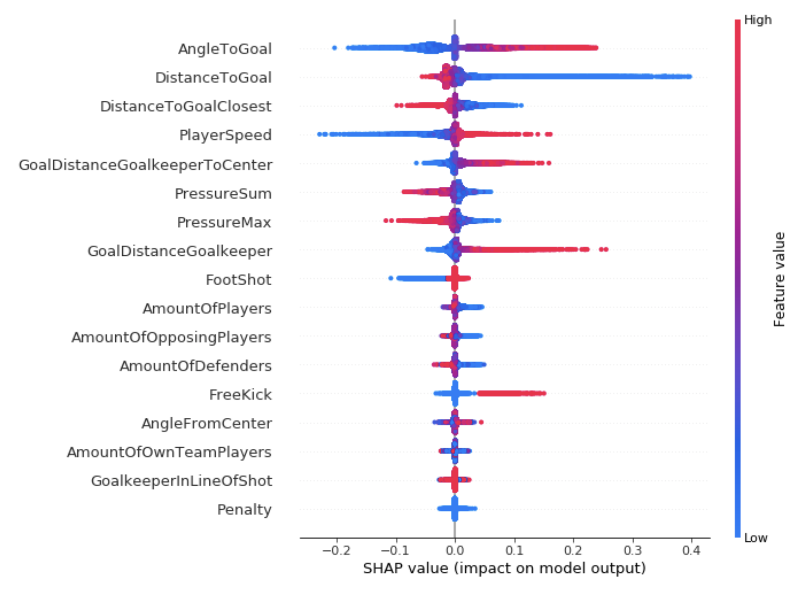

# SageMaker Clarify 
---

**마지막 업데이트: 2022.03.08**

# 1. 리소스
## 1.1 개발자 가이드
- [Amazon SageMaker SageMaker는 바이어스 감지 및 모델 설명](https://docs.aws.amazon.com/ko_kr/sagemaker/latest/dg/clarify-configure-processing-jobs.html)
- [How Clarify helps machine learning developers detect unintended bias](https://www.amazon.science/latest-news/how-clarify-helps-machine-learning-developers-detect-unintended-bias)

## 1.2 블로그
- New – Amazon SageMaker Clarify Detects Bias and Increases the Transparency of Machine Learning Models (Dec 2020)
    - 서비스 런칭시에 소개 블로그 입니다.
    - https://aws.amazon.com/ko/blogs/aws/new-amazon-sagemaker-clarify-detects-bias-and-increases-the-transparency-of-machine-learning-models/
- Explaining Bundesliga Match Facts xGoals using Amazon SageMaker Clarify (Mar 2021)
    - 독일 분데스리가 축구에서 사용 사례 
    - https://aws.amazon.com/ko/blogs/machine-learning/explaining-bundesliga-match-facts-xgoals-using-amazon-sagemaker-clarify/
    - 

## 1.3 샘플 코드    
- [SageMaker Example, Clarify](https://github.com/aws/amazon-sagemaker-examples/tree/main/sagemaker_processing/fairness_and_explainability)

