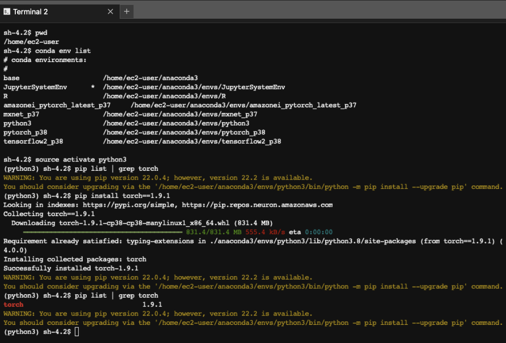

# 유용한 명령어

**마지막 업데이트: 2022.08.05**


---

# 1. 데이터 준비 
---
### \# 캐글 데이터 셋 다운로드 방법
- [Kaggle Dataset 다운로드 방법](https://github.com/mullue/amazon-sagemaker-architecting-for-ml/blob/master/Starter-Code-kr/How_to_downlaod_kaggle_data/0.download_kaggle_dataset.ipynb)

### \# S3 버켓 오너십 변경
- A 계정에서 B 계정 소유의 버켓에 파일 업로시에 B 계정이 소유하게 변경

```
import boto3

client = boto3.client('s3')

response = client.put_bucket_ownership_controls(
    Bucket= bucket,
    OwnershipControls={
        'Rules': [
            {
                'ObjectOwnership': 'BucketOwnerPreferred'
            },
        ]
    }
)
```


# 2. 개발 환경
---
### \# SageMaker Notebook Instance 에서 컨솔로 커널 접근 후 패키지 설치

```
conda env list # 커널 리스트
source activate mxnet_p36 # mxnet_p36 커널로 이동
pip install -r requirements.txt # requirements.txt 안에 있는 파이썬 패키지 설치

```
- 관련 링크: [Python 패키지를 Amazon SageMaker 노트북 인스턴스의 Conda 환경에 설치하려면 어떻게 해야 하나요?](https://aws.amazon.com/ko/premiumsupport/knowledge-center/sagemaker-python-package-conda/)

- Torch 설치 예시


### \# SageMaker Studio 의 이미지 터미널에서 net-tools 설치

```
apt update
apt install net-tools
netstat
apt install telnet
telnet
```


# 3. 모델 빌딩
---
### \# 쥬피터 노트북에서 라이브러리 자동 로딩

#### (1) 파이썬 매직 커맨드 사용
```
%load_ext autoreload
%autoreload 2
```

#### (2) 특정 라이브러리 재로딩
```
# src/p_utils.py 파일 저장된 것 재로딩

import src.p_utils 
from importlib import reload
src.p_utils = reload(src.p_utils)

from src.p_utils import download_extact_infer_file # download_extact_infer_file 함수 사용

response = download_extact_infer_file()


```


#### (3) 파이썬에서 상위 폴더의 파일을 로딩 하는 방법

- 아래와 같이 폴더 구조가 있다가 가정하고, 1_data_preparation.ipynb 노트북에서 아래와 같은 import를 사용하여 lookout_equipment_utils.py 안에 있는 함수를 로딩 함.

``` 
|-dataset
 |-utils
 | |-lookout_equipment_utils.py
 | |-aws_matplotlib_light.py
 |-notebooks
 | |-1_data_preparation.ipynb
 

sys.path.append('../utils')
import lookout_equipment_utils as lookout 
```

#### (4) try, catch 를 통한 에러 로그 프린트
```python
import traceback

try:
    print("")
    # do someting()
except Exception:
    print(traceback.format_exc())


```


# 4. 모델 훈련
---
### \# 도커 관련 명령어

#### No space left (용량 부족시)

- 모든 컨테이너 모두 삭제
    - `docker container prune -f` 


- 모든 이미지 모두 삭제
    - `docker image prune -f --all`


- 추가적인 용량 삭제가 필요하면 아래를 실행 하세요
    - `rm -rf /tmp/tmp*`

#### 다커 인터렉트 모드 (다커 안으로 진입)
- docker exec -it \<Container ID\> /bin/bash 
    
참조: 
- 도커로 사용으로 인한 시스템 용량 확보
    - [Docker의 prune 사용법](https://www.lainyzine.com/ko/article/docker-prune-usage-remove-unused-docker-objects/)
    
### \# ECR 이미지 검색
- AWS Deep Learing Containers
    - SageMaker, EC2, EKS, ECS 에서 사용 가능한 Deep Learing Containers 리스트 함.
    - https://github.com/aws/deep-learning-containers/blob/master/available_images.md
    
```
 aws ecr list-images --repository-name pytorch-inference --registry-id 763104351884 --max-items 2
 
 결과
 
  "imageIds": [
        {
            "imageDigest": "sha256:b0520e0e84509174177870af72dee152f8cf07047f9d5115c685e4440f49453e",
            "imageTag": "1.5.1-cpu-py36-ubuntu16.04-v2.3"
        },
        {
            "imageDigest": "sha256:b0520e0e84509174177870af72dee152f8cf07047f9d5115c685e4440f49453e",
            "imageTag": "1.5.1-cpu-py36-ubuntu16.04-v2.3-2020-10-21-20-34-40"
        }
    ],
 
```
```
명령어

aws ecr describe-images --repository-name pytorch-inference --registry-id 763104351884 | grep 1.8.1-gpu

결과

"1.8.1-gpu-py36-cu111-ubuntu18.04-v1.4-2021-05-04-01-07-21",
                "1.8.1-gpu-py36-cu111-ubuntu18.04-v1.4"
```


# 5. 모델 배포 및 추론
---

# 6. 패키징 및 ML Ops
---

### \# Linux 에서 파일 폴더 및 파일 리스트 출력

```
find . | sed -e "s/[^-][^\/]*\// |/g" -e "s/|\([^ ]\)/|-\1/"

예시 결과:
 |-training_tensorflow
 | |-tensorflow_train.py
 | |-requirements.txt
 |-1.1.download_data.ipynb
 |-1.2.structuring_data.ipynb 
 |-img
 | |-cifar-10.png
 | |-coco.png
```


