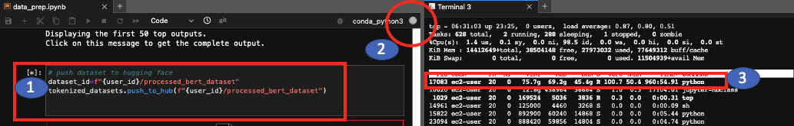

# 유용한 명령어

**마지막 업데이트: 2022.12.04**


---

# 1. 데이터 준비 
---
### \# 캐글 데이터 셋 다운로드 방법
- [Kaggle Dataset 다운로드 방법](https://github.com/mullue/amazon-sagemaker-architecting-for-ml/blob/master/Starter-Code-kr/How_to_downlaod_kaggle_data/0.download_kaggle_dataset.ipynb)


### \# Bucket 관련 명령 (오너십 변경, 버킷 삭제 등)
- [Useful Bucket Command](README-BucketCommand.md)

# 2. 개발 환경
---
### \# SageMaker Notebook Instance 에서 Cell 실행 유무 확인

노트북에서 작업을 하다면 보면, 실행 시간이 오래 걸리는 작업이 있습니다. (예: 데이터 전처리, 훈련 등). 노트북의 셀을 실행하면 야래 박스의 (1) 처럼 \'*\' 가 생성이 됩니다. 이를 통해서 실행 여부를 알 수 있고, 또한 (2) 를 통해서 알 수 있습니다. 또한 (3) 처럼 터미널에서 `top -u ec2-user` 를 실행하면 (3) 에서 셀로 실행한 프로세스가 실행되는 것을 %CPU 로 확인 할수 있습니다. 
실행 시간이 오래 걸려서, 네트워크 불안정 등으로 세션이 끊겨서 다시 연결하여 쥬피터 노트북을 열어 보변 , 보통 (1) 은 * 대신에 [] , (2) 는 색깔이 없이 빈 원으로 되어 있습니다. 이때 (3) 을 확인 합니다. 여전히 %CPU 가 높으면 셀이 실행이 되고 있는 것 입니다. 만약에 %cpu 가 작으면, 이미 그 셀의 실행은 완료가 된 상태 입니다. 이렇게 확인 한 후에 다음 셀을 실행 시키면서 작업 하시면 됩니다.





### \# SageMaker Notebook Instance 에서 컨솔로 커널 접근 후 패키지 설치

```
conda env list # 커널 리스트
source activate mxnet_p36 # mxnet_p36 커널로 이동
pip install -r requirements.txt # requirements.txt 안에 있는 파이썬 패키지 설치

```
- 관련 링크: [Python 패키지를 Amazon SageMaker 노트북 인스턴스의 Conda 환경에 설치하려면 어떻게 해야 하나요?](https://aws.amazon.com/ko/premiumsupport/knowledge-center/sagemaker-python-package-conda/)

- Torch 설치 예시


### \# SageMaker Studio 의 이미지 터미널에서 net-tools 설치

```
apt update
apt install net-tools
netstat
apt install telnet
telnet
```


# 3. 모델 빌딩
---
### \# 쥬피터 노트북에서 라이브러리 자동 로딩

#### (1) 파이썬 매직 커맨드 사용
```
%load_ext autoreload
%autoreload 2
```

#### (2) 특정 라이브러리 재로딩
```
# src/p_utils.py 파일 저장된 것 재로딩

import src.p_utils 
from importlib import reload
src.p_utils = reload(src.p_utils)

from src.p_utils import download_extact_infer_file # download_extact_infer_file 함수 사용

response = download_extact_infer_file()


```


#### (3) 파이썬에서 상위 폴더의 파일을 로딩 하는 방법

- 아래와 같이 폴더 구조가 있다가 가정하고, 1_data_preparation.ipynb 노트북에서 아래와 같은 import를 사용하여 lookout_equipment_utils.py 안에 있는 함수를 로딩 함.

``` 
|-dataset
 |-utils
 | |-lookout_equipment_utils.py
 | |-aws_matplotlib_light.py
 |-notebooks
 | |-1_data_preparation.ipynb
 

sys.path.append('../utils')
import lookout_equipment_utils as lookout 
```

#### (4) try, catch 를 통한 에러 로그 프린트
```python
import traceback

try:
    print("")
    # do someting()
except Exception:
    print(traceback.format_exc())


```
#### (5) 디버깅: 폴더 하위 구조 확인하기 
```python
import os

def print_files_in_dir(root_dir, prefix):
    files = os.listdir(root_dir)
    for file in files:
        path = os.path.join(root_dir, file)
        print(prefix + path)
        if os.path.isdir(path):
            print_files_in_dir(path, prefix + "    ")
            
print_files_in_dir(root_dir = "codecommit", prefix="")            

예시 결과:
codecommit/img
    codecommit/img/pipeline-full.png
codecommit/origin-sagemaker-pipelines-project.ipynb
codecommit/codebuild-buildspec-origin.yml
codecommit/tox.ini
codecommit/codebuild-buildspec.yml
codecommit/tests
    codecommit/tests/test_pipelines.py
    codecommit/tests/.ipynb_checkpoints
        codecommit/tests/.ipynb_checkpoints/test_pipelines-checkpoint.py
codecommit/LICENSE
codecommit/pipelines
    codecommit/pipelines/upload_code.py
```
#### (6) 코드팁 : YYYY-MM-DD-HH-MM-SS 추출하기
```python
from datetime import datetime
currentDateAndTime = datetime.now()


currentTime = currentDateAndTime.strftime("%Y-%m-%d-%H-%M-%S")
print("The current time is", currentTime)
# The current time is 10:06:55
```

#### (7) Git Command
- [README-GitCommand.md](README-GitCommand.md)

# 4. 모델 훈련
---
### \# 도커 관련 명령어
- 유용한 도커 명령어가 아래 정리되어 있습니다.
    - [README-DockerCommand.md](README-DockerCommand.md)

    
### \# ECR 이미지 검색
- AWS Deep Learing Containers
    - SageMaker, EC2, EKS, ECS 에서 사용 가능한 Deep Learing Containers 리스트 함.
    - https://github.com/aws/deep-learning-containers/blob/master/available_images.md
- 아래 명령어는 실행되는 user 혹은  role 에 "AmazonEC2ContainerRegistryFullAccess " 정책이 있어야 합니다.

```
 aws ecr list-images --repository-name pytorch-inference --registry-id 763104351884 --max-items 2
 
 결과
 
  "imageIds": [
        {
            "imageDigest": "sha256:b0520e0e84509174177870af72dee152f8cf07047f9d5115c685e4440f49453e",
            "imageTag": "1.5.1-cpu-py36-ubuntu16.04-v2.3"
        },
        {
            "imageDigest": "sha256:b0520e0e84509174177870af72dee152f8cf07047f9d5115c685e4440f49453e",
            "imageTag": "1.5.1-cpu-py36-ubuntu16.04-v2.3-2020-10-21-20-34-40"
        }
    ],
 
```
```
명령어

aws ecr describe-images --repository-name pytorch-inference --registry-id 763104351884 | grep 1.8.1-gpu

결과

"1.8.1-gpu-py36-cu111-ubuntu18.04-v1.4-2021-05-04-01-07-21",
                "1.8.1-gpu-py36-cu111-ubuntu18.04-v1.4"
```


# 5. 모델 배포 및 추론
---
## \# SageMaker PyTorchModel passing custom variables
SageMaker Model (예: PyTorchModel) 생성시에 "사용자 정의 변수 (custom variables)" 를 제공하여, 모델 서빙시에 사용할 수 있을까?

- 관련 사용 시나리오
    - 모델 A, 모델 B 가 존재하고, 각각의 모델은 Pytorch TorchServe 로 모델 서빙을 각각 하고, 다음의 추론 도커 이미지를 사용 합니다.(  763104351884.dkr.ecr.us-east-1.amazonaws.com/pytorch-inference   1.8.1-gpu-py3 ). 
    - 모델 A, 모델 B 를 model_fn() 통하여 모델 로딩시에 model_A.json (모델 로딩시 설정 변수 포함), model_B.json 이 필요 합니다.
    - 임의의 코드는 아래와 같습니다.
    
```Python    
    def model_fn(model_dir):
        Category = "A"
        model_config_path = f"model_{Category}.json"
        model_config_dict = load_json(model_config_path)        
        
        model_user_num = int(model_config_dict["user_num"])
        model_item_num = int(model_config_dict["item_num"])
        model_factor_num = int(model_config_dict["factor_num"])

        # 모델 네트워크 로딩
        inf_model = model.Net(model_user_num, model_item_num, model_factor_num)
        
        # 모델 가중치 로딩    
        with open(model_file_path, "rb") as f:
              inf_model.load_state_dict(torch.load(f))            
        
        return inf_model
```
- 위를 해결할 수 있는 방법은 아래와 같이 PyTorchModel() 를 생성시에 환경 변수를 제공합니다.
                     
```Python
local_pytorch_model = PyTorchModel(model_data=local_model_path,
                                   role=role,
                                   entry_point='inference.py',
                                   source_dir = 'src',
                                   framework_version='1.8.1',
                                   py_version='py3',
                                   model_server_workers=1,
                                   env={'Category' : 'A'}
                                  )
```
- 이후에 model_fn() 에서  `Category = "A"` 대신에 `Category = os.environ["Category"]` 를 통하여 제공된 변수의 값을 얻습니다.
    
- 참고 : PyTorchModel 의 상위 클래스 개발자 가이드
    - [SageMaker Python SDK, Model](https://sagemaker.readthedocs.io/en/stable/api/inference/model.html#sagemaker.model.Model)


# 6. 패키징 및 ML Ops
---

### \# Linux 에서 파일 폴더 및 파일 리스트 출력

```
find . | sed -e "s/[^-][^\/]*\// |/g" -e "s/|\([^ ]\)/|-\1/"

예시 결과:
 |-training_tensorflow
 | |-tensorflow_train.py
 | |-requirements.txt
 |-1.1.download_data.ipynb
 |-1.2.structuring_data.ipynb 
 |-img
 | |-cifar-10.png
 | |-coco.png
```

# 7. 기타 디버깅 코드
---
### \# 해당 s3 의 model.tar.gz 파일을 다운로드 하고 압축 해제하는 코드 임
- 노트북 셀에서 변수 저장
```
s3_path = 's3://sagemaker-us-east-1-XXXXX/ncf/repackage/model/2022-11-14-12-49-10/model.tar.gz'
tar_name = 'model.tar.gz'
```
- 노트북 셀에서 아래 명령어 실행
```
%%sh -s {s3_path} {tar_name}
s3_path=$1
tar_name=$2
echo $s3_path
aws s3 ls $s3_path
mkdir -p temp
aws s3 cp $s3_path temp
cd temp
tar -xzvf $tar_name 
```


