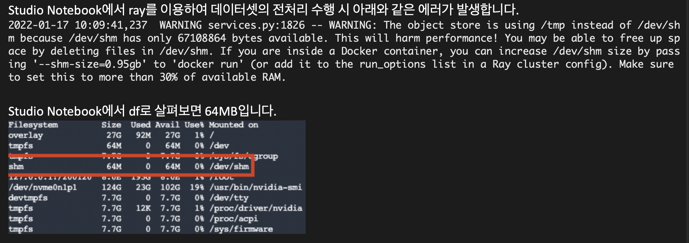
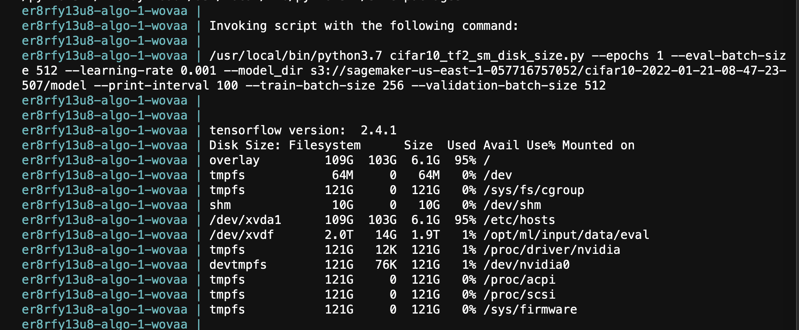

# 에러: 1.1 SageMaker Studio Notebook 에서 Shared Memory (shm) 제약 사항 (64MB)
## 1. 에러 현상
- SageMaker Studio Notebook 에서 로컬로 작업시에 Shared Memory 가 부족하여 생기는 현상 입니다. 예를 들어서 Pytorch 의 data loader 를 사용시에 메모리가 부족해서 에러가 발생할 수 있습니다.
어려운 점은 SageMaker Studio Notebook가 Docker 로 실행이 되기에 shm 의 사이즈를 현재(Jan 2022) 수정할 수 없습니다. 그래서 아래는 64MB 제약으로 인한 에러 내용 입니다.

- 

## 2. 워크라운드
- 실험을 스튜디오 노트북 대신에 SageMaker Classic Notebook 에서 Local Mode 를 통해서 실험 합니다. Local Model에서 shm 의 사이즈를 수정하여 테스트를 하고 이후에 관리형 EC2 인스턴스를 통해서 훈련을 하는 방법을 권장 합니다. 
    - 참고: 로컬 모드 설명 --> [Use the Amazon SageMaker local mode to train on your notebook instance](https://aws.amazon.com/blogs/machine-learning/use-the-amazon-sagemaker-local-mode-to-train-on-your-notebook-instance/)
        - 참고로 스튜디오 노트북에서는 로컬 모드가 지원이 안됩니다.
    
    
- SageMaker Classic Notebook 의 shm 수정 방법
    - SageMaker Classic Notebook은 docker 에서 실행되는 것이 아니라, 관리형 EC2 에서 실행이 되기에 shm 을 다커 에서 사용하는 것을 수정할 수 있습니다. 방법은 아래와 같습니다.

    - [1] SageMaker Classic Notebook 에서 terminal 을 실행 합니다.
    - [2] 이후 docker 설정 파일을 수정 
        - sudo vim /etc/docker/daemon.json
        - 다음과 같이 원하시는 용량을 기술하시면 됩니다. (아래는 GPU 가 있는 ml.p3.8xlarge 에서 테스트 했습니다.)
        
            ```    
            cat daemon.json 
            {
                "runtimes": {
                    "nvidia": {
                        "path": "nvidia-container-runtime",
                        "runtimeArgs": []
                    },
                    "default-shm-size": "10G"
                }
            }
            ```

    - [3] docker 데몬을 재시작 합니다.
        - sudo service docker restart
        - 위의 명령은 Amazon linux 1 의 경우에 사용 합니다.
        - 참고 화인 방법
        
            ```
            cat /etc/os-release
            NAME="Amazon Linux AMI"
            VERSION="2018.03"
            ID="amzn"
            ID_LIKE="rhel fedora"
            VERSION_ID="2018.03"
            PRETTY_NAME="Amazon Linux AMI 2018.03"
            ANSI_COLOR="0;33"
            CPE_NAME="cpe:/o:amazon:linux:2018.03:ga"
            HOME_URL="http://aws.amazon.com/amazon-linux-ami/"
            ```
            
        - Amazon Linux 2 의 경우는
            - sudo systemctl restart docker

    - [4] 결과 확인
        - 아래 처럼 로컬 모드로 도커 컨테이너를 실행을 하면서 df -h 명령어를 통해서 학인 하였습니다. shm 이 10G 로 바뀐 것을 확인 할 수 있습니다.
            - 참고로 위와 같은 세팅을 한 후에 다음의 노트북을 실행하여 결과를 테스트 했습니다.  
                - [세이지 메이커 로컬 모드 및 스크립트 모드로 훈련](https://github.com/gonsoomoon-ml/SageMaker-Tensorflow-Step-By-Step/blob/main/code/phase0/2.1.1.Train_TF_Local_Script_Mode_DiskSize.ipynb)
                
                
- 
    


## 3. 관련 에러 링크
- PyTorch: increasing --shm-size to allow multiprocessing data loaders #937
    - https://github.com/aws/sagemaker-python-sdk/issues/937

