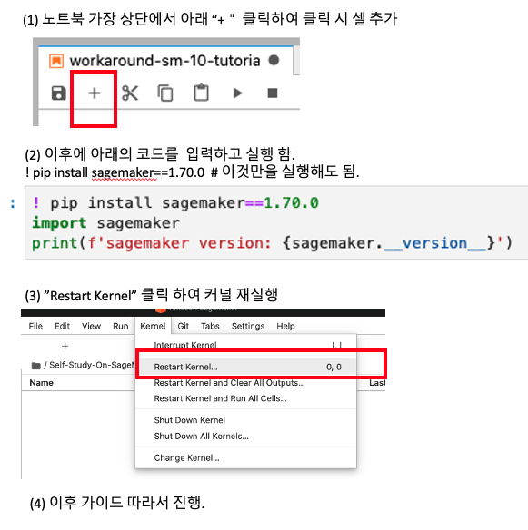

# 주요 트러블 슈팅
**마지막 업데이트: 2022.01.21**

---


# 1. SageMaker Studio Notebook

## 1.1 SageMaker Studio Notebook 에서 Shared Memory (shm) 제약 사항 (64MB) 에러
- [관련 에러 및 워크라운드](sagemaker_studio_nb_shm_error.md)


# 2. 기타

## 2.1 SageMaker 10분 튜토리얼 에러 해결 방법
### 에러
다음 코드 실행하고 
- ```s3_input_train = sagemaker.s3_input(s3_data='s3://{}/{}/train'.format(bucket_name, prefix), content_type='csv')```

아래와 같은 에러 발생시
- ```AttributeError: module 'sagemaker' has no attribute 's3_input'```


### 해결 방법
- 현재의 코드가 sagemaker 1.xx 버전으로 되어 있습니다. 아래와 같이 진행하시기 바랍니다.
- 아래에 sagemaker 버전을 2.xx 에서 1.70 버전으로 다운그레이드 합니다.
- ***아래 (1), (2), (3) 을 진행하시고, 처음 부터 다시 하시기 바랍니다.***



위의 이미지의 코드 입니다. (복사 및 붙이기 하시면 됩니다.)
```
! pip install sagemaker==1.70.0
import sagemaker
print(f'sagemaker version: {sagemaker.__version__}')
```

